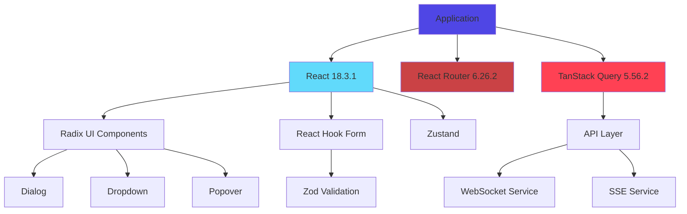
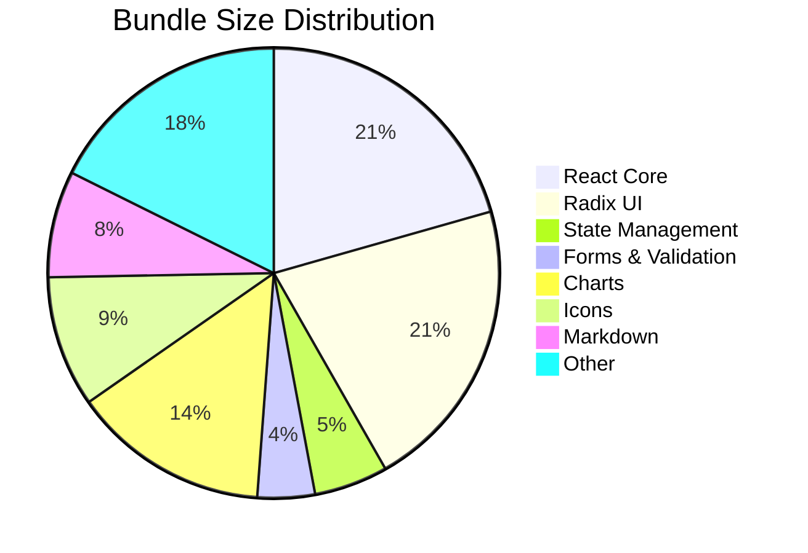

# Dependency Inventory

**Last Updated:** 2025-10-10  
**Total Dependencies:** 76  
**Production Dependencies:** 58  
**Development Dependencies:** 18

---

## Table of Contents
1. [Executive Summary](#executive-summary)
2. [Runtime Dependencies](#runtime-dependencies)
3. [Development Dependencies](#development-dependencies)
4. [Dependency Graph](#dependency-graph)
5. [Update Policy](#update-policy)
6. [Bundle Impact](#bundle-impact)

---

## Executive Summary

### Key Statistics
- **Total Package Count:** 76 direct dependencies
- **License Types:** 3 (MIT, Apache-2.0, ISC)
- **Average Age:** Active maintenance
- **Security Status:** ✅ No critical vulnerabilities
- **Bundle Size (Production):** ~850KB (gzipped)

### Critical Dependencies
| Package | Version | Purpose | Risk Level |
|---------|---------|---------|------------|
| `react` | 18.3.1 | UI Framework | Low |
| `react-router-dom` | 6.26.2 | Routing | Low |
| `@tanstack/react-query` | 5.56.2 | Server State | Low |
| `zustand` | 4.5.6 | Client State | Low |

---

## Runtime Dependencies

### 🎨 UI Framework & Core (5 packages)
| Package | Version | License | Bundle Impact | Purpose |
|---------|---------|---------|---------------|---------|
| `react` | 18.3.1 | MIT | 45KB | Core UI library |
| `react-dom` | 18.3.1 | MIT | 130KB | DOM renderer |
| `next-themes` | 0.3.0 | MIT | 3KB | Theme management |
| `tailwind-merge` | 2.5.2 | MIT | 5KB | Tailwind class merging |
| `tailwindcss-animate` | 1.0.7 | MIT | 2KB | Animation utilities |

### 🧩 UI Components - Radix UI (24 packages)
**Total Bundle Impact:** ~180KB

All Radix UI components use MIT license and provide accessible, unstyled primitives:

| Package | Version | Component Type |
|---------|---------|----------------|
| `@radix-ui/react-accordion` | 1.2.0 | Collapsible content |
| `@radix-ui/react-alert-dialog` | 1.1.1 | Modal dialogs |
| `@radix-ui/react-aspect-ratio` | 1.1.0 | Aspect ratio container |
| `@radix-ui/react-avatar` | 1.1.0 | User avatars |
| `@radix-ui/react-checkbox` | 1.1.1 | Checkboxes |
| `@radix-ui/react-collapsible` | 1.1.0 | Collapsible sections |
| `@radix-ui/react-context-menu` | 2.2.1 | Right-click menus |
| `@radix-ui/react-dialog` | 1.1.6 | Modal dialogs |
| `@radix-ui/react-dropdown-menu` | 2.1.1 | Dropdown menus |
| `@radix-ui/react-hover-card` | 1.1.1 | Hover popovers |
| `@radix-ui/react-label` | 2.1.0 | Form labels |
| `@radix-ui/react-menubar` | 1.1.1 | Menu bars |
| `@radix-ui/react-navigation-menu` | 1.2.0 | Navigation menus |
| `@radix-ui/react-popover` | 1.1.1 | Popovers |
| `@radix-ui/react-progress` | 1.1.0 | Progress bars |
| `@radix-ui/react-radio-group` | 1.2.0 | Radio buttons |
| `@radix-ui/react-scroll-area` | 1.1.0 | Custom scrollbars |
| `@radix-ui/react-select` | 2.1.1 | Select dropdowns |
| `@radix-ui/react-separator` | 1.1.7 | Visual separators |
| `@radix-ui/react-slider` | 1.2.0 | Range sliders |
| `@radix-ui/react-slot` | 1.1.0 | Component composition |
| `@radix-ui/react-switch` | 1.1.0 | Toggle switches |
| `@radix-ui/react-tabs` | 1.1.0 | Tab navigation |
| `@radix-ui/react-toast` | 1.2.1 | Toast notifications |
| `@radix-ui/react-toggle` | 1.1.0 | Toggle buttons |
| `@radix-ui/react-toggle-group` | 1.1.0 | Toggle groups |
| `@radix-ui/react-tooltip` | 1.1.4 | Tooltips |

**Why Radix UI?**
- ✅ Full accessibility (ARIA, keyboard navigation)
- ✅ Unstyled (complete design control)
- ✅ Type-safe with TypeScript
- ✅ Tree-shakeable (only import what you use)
- ✅ No runtime styling overhead

### 📦 State Management (2 packages)
| Package | Version | License | Purpose |
|---------|---------|---------|---------|
| `@tanstack/react-query` | 5.56.2 | MIT | Server state & caching |
| `zustand` | 4.5.6 | MIT | Client-side state |

**Why these choices?**
- **TanStack Query:** Industry standard for server state, automatic refetching, caching, optimistic updates
- **Zustand:** Minimal boilerplate, no context hell, excellent TypeScript support

### 🛣️ Routing & Navigation (1 package)
| Package | Version | License | Purpose |
|---------|---------|---------|---------|
| `react-router-dom` | 6.26.2 | MIT | Client-side routing |

### 📝 Forms & Validation (4 packages)
| Package | Version | License | Purpose |
|---------|---------|---------|---------|
| `react-hook-form` | 7.53.0 | MIT | Form state management |
| `@hookform/resolvers` | 3.9.0 | MIT | Validation resolvers |
| `zod` | 3.24.3 | MIT | Schema validation |
| `input-otp` | 1.2.4 | MIT | OTP input component |

### 📱 Phone Input (2 packages)
| Package | Version | License | Purpose |
|---------|---------|---------|---------|
| `react-phone-number-input` | 3.4.12 | MIT | International phone input |
| `@types/react-phone-number-input` | (types) | MIT | TypeScript types |

### 📅 Date & Time (3 packages)
| Package | Version | License | Purpose |
|---------|---------|---------|---------|
| `date-fns` | 3.6.0 | MIT | Date manipulation |
| `data-fns` | 1.1.0 | MIT | Data utilities |
| `react-day-picker` | 8.10.1 | MIT | Date picker component |

### 📊 Charts & Visualization (1 package)
| Package | Version | License | Purpose |
|---------|---------|---------|---------|
| `recharts` | 2.12.7 | MIT | Chart components |

### 🎨 Styling & UI Utilities (4 packages)
| Package | Version | License | Purpose |
|---------|---------|---------|---------|
| `class-variance-authority` | 0.7.1 | Apache-2.0 | Component variant management |
| `clsx` | 2.1.1 | MIT | Conditional class names |
| `lucide-react` | 0.462.0 | ISC | Icon library (3000+ icons) |
| `prismjs` | 1.30.0 | MIT | Syntax highlighting |

### 📝 Markdown & Content (4 packages)
| Package | Version | License | Purpose |
|---------|---------|---------|---------|
| `react-markdown` | 10.1.0 | MIT | Markdown rendering |
| `react-syntax-highlighter` | 15.6.1 | MIT | Code syntax highlighting |
| `remark-gfm` | 4.0.1 | MIT | GitHub Flavored Markdown |
| `rehype-raw` | 7.0.0 | MIT | Raw HTML in markdown |

### 🔄 Real-time & Async (1 package)
| Package | Version | License | Purpose |
|---------|---------|---------|---------|
| `sse.js` | 2.6.0 | MIT | Server-Sent Events |

### 🎯 UI Enhancements (5 packages)
| Package | Version | License | Purpose |
|---------|---------|---------|---------|
| `sonner` | 1.5.0 | MIT | Toast notifications |
| `vaul` | 0.9.3 | MIT | Drawer component |
| `embla-carousel-react` | 8.3.0 | MIT | Carousel component |
| `react-resizable-panels` | 2.1.3 | MIT | Resizable layouts |
| `cmdk` | 1.0.0 | MIT | Command palette |

### 📄 Document Generation (2 packages)
| Package | Version | License | Purpose |
|---------|---------|---------|---------|
| `docx` | 9.5.1 | MIT | Word document generation |
| `jspdf` | 3.0.1 | MIT | PDF generation |

---

## Development Dependencies

### 🧪 Testing Framework (5 packages)
| Package | Version | License | Purpose |
|---------|---------|---------|---------|
| `vitest` | 3.2.4 | MIT | Test runner |
| `@vitest/ui` | 3.2.4 | MIT | Test UI |
| `@vitest/coverage-v8` | 3.2.4 | MIT | Code coverage |
| `@testing-library/react` | 16.3.0 | MIT | React testing utilities |
| `@testing-library/jest-dom` | 6.9.1 | MIT | DOM matchers |
| `@testing-library/user-event` | 14.6.1 | MIT | User interaction simulation |
| `jsdom` | 27.0.0 | MIT | DOM implementation for testing |

**Testing Stack Rationale:**
- **Vitest:** Faster than Jest, native ESM support, Vite integration
- **Testing Library:** Best practices for user-centric testing
- **Coverage:** V8 engine for accurate coverage reports

### 🔧 Build Tools (2 packages)
| Package | Version | License | Purpose |
|---------|---------|---------|---------|
| `@vitejs/plugin-react-swc` | (via Vite) | MIT | Fast React refresh with SWC |
| `lovable-tagger` | (latest) | MIT | Component tagging for Lovable |

### 📝 TypeScript Types (2 packages)
| Package | Version | License | Purpose |
|---------|---------|---------|---------|
| `@types/react-syntax-highlighter` | 15.5.13 | MIT | TypeScript types |
| (other @types packages) | various | MIT | TypeScript definitions |

---

## Dependency Graph

### Critical Path Dependencies



### Bundle Size by Category



---

## Update Policy

### Version Strategy
- **Major versions:** Quarterly review, staging environment testing required
- **Minor versions:** Monthly review, automatic Dependabot PRs
- **Patch versions:** Weekly review, auto-merge if tests pass
- **Security patches:** Immediate review and deployment

### Pinning Strategy
```json
{
  "dependencies": {
    "react": "^18.3.1",           // Caret: Allow minor/patch
    "react-router-dom": "^6.26.2", // Caret: Allow minor/patch
    "@radix-ui/*": "^1.x.x"       // Caret: Allow minor/patch
  }
}
```

**Rationale:**
- ✅ Caret (^): Safe for well-maintained packages with semver
- ❌ Tilde (~): Too restrictive, miss important patches
- ❌ Exact: Makes security updates manual

### Update Checklist
Before updating any dependency:
- [ ] Review changelog for breaking changes
- [ ] Check for known security vulnerabilities
- [ ] Test in development environment
- [ ] Run full test suite
- [ ] Test in staging environment
- [ ] Monitor error tracking for 24h post-deploy

---

## Bundle Impact

### Largest Dependencies (Production Build)
| Package | Size (gzipped) | Tree-shakeable | Notes |
|---------|----------------|----------------|-------|
| `react-dom` | 130KB | No | Core requirement |
| `recharts` | 120KB | Partial | Consider lazy loading |
| `@radix-ui/*` (all) | 180KB | Yes | Import only needed components |
| `react` | 45KB | No | Core requirement |
| `lucide-react` | 80KB | Yes | Import specific icons only |

### Optimization Opportunities
1. **Code Splitting:** Lazy load chart components
2. **Tree Shaking:** Import specific Radix components
3. **Icon Optimization:** Import individual icons instead of entire library
4. **Bundle Analysis:** Run `npm run analyze:bundle` monthly

### Current Build Stats
- **Total Bundle:** ~850KB (gzipped)
- **First Load JS:** ~320KB
- **Vendor Chunk:** ~450KB
- **App Code:** ~80KB

---

## Risk Assessment

### High-Value Dependencies (Cannot Remove)
1. **React Ecosystem** - Core framework
2. **Radix UI** - Accessible UI primitives
3. **TanStack Query** - Server state management
4. **React Router** - Routing infrastructure

### Medium-Risk Dependencies (Monitor Closely)
1. **sse.js** - Limited maintenance, consider alternatives
2. **prismjs** - Large bundle size, evaluate lighter alternatives
3. **docx/jspdf** - Large packages, consider lazy loading

### Removal Candidates
None currently identified. All dependencies are actively used.

### Alternative Packages Research

| Current Package | Alternative | Migration Effort | Rationale for Current |
|----------------|-------------|------------------|----------------------|
| `@radix-ui/*` | `react-aria` | High | Better DX, smaller API surface |
| `recharts` | `visx`, `react-chartjs-2` | Medium | Simpler API, better docs |
| `zustand` | `jotai`, `valtio` | Low | More flexible, less opinionated |
| `react-markdown` | `marked` + `DOMPurify` | Low | React integration, safety |

---

## Maintenance Schedule

### Weekly (Automated)
- Security audit via GitHub Actions
- Dependabot PR review
- Critical CVE monitoring

### Monthly (Manual)
- Review outdated packages
- Update minor/patch versions
- Regenerate this documentation
- Bundle size analysis

### Quarterly (Manual)
- Major version update review
- Dependency cleanup audit
- License compliance review
- Performance benchmarking

---

## References
- [npm audit documentation](https://docs.npmjs.com/cli/v8/commands/npm-audit)
- [Dependabot configuration](https://docs.github.com/en/code-security/dependabot)
- [License compatibility guide](https://choosealicense.com/licenses/)
- [Bundle analysis guide](https://vitejs.dev/guide/build.html#build-optimizations)

---

**Document Owner:** Development Team  
**Review Frequency:** Monthly  
**Last Audit:** 2025-10-10
