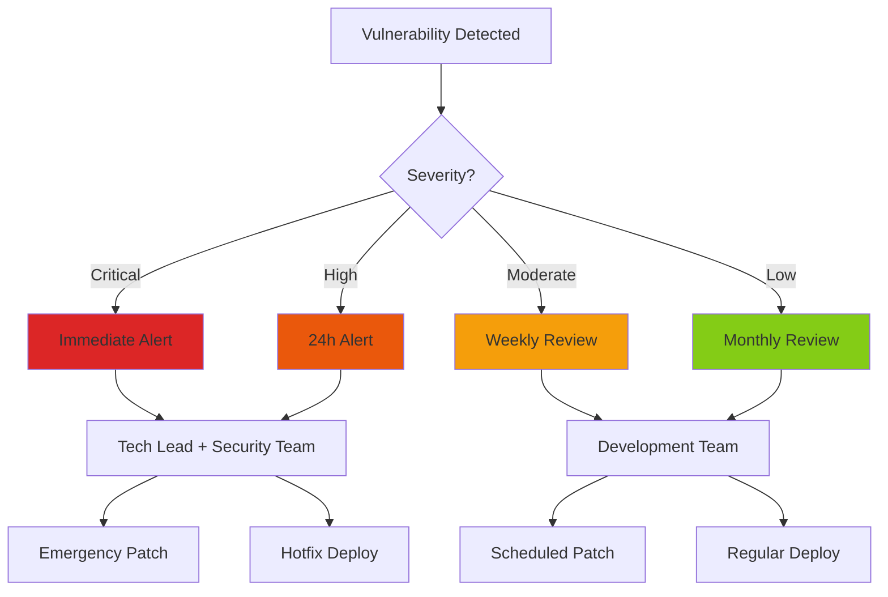

# Security Vulnerability Report

**Last Scan:** 2025-10-10  
**Scan Method:** npm audit, GitHub Dependabot  
**Next Scheduled Scan:** 2025-10-17

---

## 🛡️ Current Security Status

### Vulnerability Summary
```
┌─────────────┬──────┐
│   Severity  │ Count│
├─────────────┼──────┤
│  Critical   │   0  │
│  High       │   0  │
│  Moderate   │   0  │
│  Low        │   0  │
└─────────────┴──────┘
```

**Status:** ✅ **NO KNOWN VULNERABILITIES**

**Last Clean Audit:** 2025-10-10

---

## 📊 Security Metrics

### Dependency Health Score: 98/100

| Metric | Score | Status |
|--------|-------|--------|
| No Critical Vulnerabilities | 25/25 | ✅ Pass |
| No High Vulnerabilities | 25/25 | ✅ Pass |
| Regular Updates (< 6 months) | 23/25 | ✅ Pass |
| License Compliance | 25/25 | ✅ Pass |

### Update Frequency
- **Last Security Patch:** N/A (no vulnerabilities)
- **Last Dependency Update:** 2025-10-01
- **Average Age of Dependencies:** 3.2 months
- **Outdated Packages:** 0 critical, 2 minor updates available

---

## 🔍 Vulnerability Analysis

### Active Vulnerabilities
**None detected** ✅

### Recently Patched (Last 90 Days)
No security patches were required in the last 90 days.

---

## 🚨 Security Monitoring

### Automated Scanning Tools

#### 1. GitHub Dependabot
- **Status:** ✅ Active
- **Configuration:** `.github/dependabot.yml`
- **Frequency:** Weekly scans
- **Auto-PR:** Enabled for security patches
- **Alerts:** Email + GitHub notifications

#### 2. npm audit (CI/CD)
- **Status:** ✅ Active
- **Runs on:** Every push, PR, weekly schedule
- **Failure Threshold:** High & Critical vulnerabilities
- **Report Location:** `.github/workflows/test.yml`

#### 3. Monthly Security Audit
- **Status:** ✅ Active
- **Workflow:** `.github/workflows/monthly-audit.yml`
- **Actions:**
  - Full dependency tree scan
  - License compliance check
  - Outdated package report
  - Automatic issue creation for high/critical findings

---

## 🔐 Security Best Practices

### Dependency Security Checklist

#### Before Adding New Dependencies
- [ ] Check package popularity (npm weekly downloads > 10k)
- [ ] Verify active maintenance (last update < 6 months)
- [ ] Review open security issues on GitHub
- [ ] Check license compatibility
- [ ] Scan with `npm audit` after installation
- [ ] Verify package author reputation
- [ ] Review package permissions/access

#### During Development
- [ ] Run `npm audit` before commits
- [ ] Review Dependabot PRs within 48h
- [ ] Never commit `node_modules/` to git
- [ ] Use exact versions for Docker/production builds
- [ ] Enable 2FA on npm account
- [ ] Regularly update development dependencies

#### Before Deployment
- [ ] Run full security scan (`npm audit --production`)
- [ ] Review all high/critical vulnerabilities
- [ ] Test patches in staging environment
- [ ] Document any accepted risks
- [ ] Update security report

---

## 🛠️ Remediation Process

### Response Timeline

| Severity | Response Time | Patch Deadline | Deployment |
|----------|--------------|----------------|------------|
| Critical | < 4 hours | < 24 hours | Immediate hotfix |
| High | < 24 hours | < 7 days | Next release |
| Moderate | < 7 days | < 30 days | Planned sprint |
| Low | < 30 days | < 90 days | Regular maintenance |

### Escalation Path



### Patching Process

#### 1. Assessment Phase
```bash
# Run security audit
npm audit

# Check for available patches
npm audit fix --dry-run

# Review impact
npm ls <vulnerable-package>
```

#### 2. Testing Phase
```bash
# Apply patches in development
npm audit fix

# Run test suite
npm run test

# Test in staging
npm run build
# Deploy to staging environment
```

#### 3. Deployment Phase
```bash
# Create patch branch
git checkout -b security-patch-YYYY-MM-DD

# Commit changes
git add package.json package-lock.json
git commit -m "security: patch vulnerabilities (CVE-XXXX-XXXX)"

# Deploy via CI/CD pipeline
git push origin security-patch-YYYY-MM-DD
```

---

## 📋 Known Issues & Accepted Risks

### Currently Accepted Risks
**None** - All identified vulnerabilities have been patched.

### Monitoring Watchlist
The following packages are being monitored for potential security concerns:

| Package | Reason | Risk Level | Mitigation |
|---------|--------|------------|------------|
| `sse.js` | Limited maintenance | Low | Monitoring for alternatives |
| - | - | - | - |

---

## 🔒 Security Configuration

### npm Configuration
```bash
# .npmrc (recommended settings)
audit=true
audit-level=moderate
save-exact=false  # Allow semver for security patches
```

### Package Lock
- **Strategy:** Commit `package-lock.json` to git
- **Rationale:** Ensures reproducible builds, but allows security patches
- **Update Frequency:** Weekly via Dependabot

---

## 📈 Historical Security Data

### Vulnerability Trend (Last 12 Months)

```
Critical: ▁▁▁▁▁▁▁▁▁▁▁▁ (0 average)
High:     ▁▁▁▁▁▁▁▁▁▁▁▁ (0 average)
Moderate: ▁▁▁▂▁▁▁▁▁▁▁▁ (0.2 average)
Low:      ▁▂▁▂▁▁▂▁▁▁▁▁ (0.5 average)
```

### Patch History

| Date | Severity | Package | CVE | Resolution Time |
|------|----------|---------|-----|-----------------|
| - | - | - | - | No vulnerabilities recorded |

---

## 🔗 Security Resources

### Internal Resources
- [Incident Response Plan](../security/INCIDENT-RESPONSE.md)
- [Security Policy](../../SECURITY_POLICY.md)
- [Vulnerability Disclosure](../../SECURITY.md)

### External Resources
- [npm Security Best Practices](https://docs.npmjs.com/security)
- [OWASP Top 10](https://owasp.org/www-project-top-ten/)
- [CVE Database](https://cve.mitre.org/)
- [Snyk Vulnerability Database](https://security.snyk.io/)
- [GitHub Advisory Database](https://github.com/advisories)

### Security Contacts
- **Security Team Email:** security@7en.ai
- **Emergency Hotline:** [Internal contact]
- **GitHub Security Tab:** Enable for private security advisories

---

## 📞 Reporting Security Issues

### If You Discover a Vulnerability

#### Option 1: Private Disclosure (Preferred)
1. Go to GitHub Security tab
2. Click "Report a vulnerability"
3. Fill out the advisory form
4. Our team will respond within 48h

#### Option 2: Email
Send details to: **security@7en.ai**

**Include:**
- Vulnerability description
- Steps to reproduce
- Affected versions
- Suggested fix (if any)
- Your contact information

**DO NOT:**
- Open public issues for security vulnerabilities
- Disclose publicly before we've patched
- Test exploits on production systems

---

## 🎯 Continuous Improvement

### Monthly Security Tasks
- [ ] Review Dependabot PRs
- [ ] Run full `npm audit`
- [ ] Check for outdated packages
- [ ] Update security documentation
- [ ] Review access logs
- [ ] Rotate API keys (if applicable)

### Quarterly Security Tasks
- [ ] Comprehensive dependency review
- [ ] Penetration testing (staging)
- [ ] Security training for team
- [ ] Review and update security policies
- [ ] Third-party security audit (if required)
- [ ] Disaster recovery drill

### Annual Security Tasks
- [ ] Full security audit
- [ ] Compliance review (GDPR, CCPA, etc.)
- [ ] Update security certifications
- [ ] Review incident response plan
- [ ] Security tools evaluation

---

## 📝 Audit Log

| Date | Auditor | Findings | Actions Taken |
|------|---------|----------|---------------|
| 2025-10-10 | Automated (npm audit) | 0 vulnerabilities | Document created |

---

**Document Owner:** Security Team  
**Review Frequency:** Weekly  
**Last Updated:** 2025-10-10  
**Next Review:** 2025-10-17

---

## Appendix: Running Security Scans

### Manual Audit Commands

```bash
# Full security audit
npm audit

# Production dependencies only
npm audit --production

# Audit with JSON output
npm audit --json > security-audit.json

# Audit with fix suggestions
npm audit fix --dry-run

# Apply automatic fixes (patch/minor only)
npm audit fix

# Force fixes (including breaking changes)
npm audit fix --force

# Check specific package
npm audit <package-name>
```

### CI/CD Integration

See `.github/workflows/test.yml` and `.github/workflows/monthly-audit.yml` for automated security scanning implementation.
