# Security Incident Response Plan for 7en.ai Platform

**Version:** 1.0  
**Last Updated:** 2025-10-10  
**Status:** Active  
**Classification:** Internal Use

---

## Table of Contents

1. [Overview](#overview)
2. [Incident Types](#incident-types)
3. [Response Team](#response-team)
4. [Incident Response Process](#incident-response-process)
5. [Specific Incident Procedures](#specific-incident-procedures)
6. [Communication Protocols](#communication-protocols)
7. [Post-Incident Activities](#post-incident-activities)

---

## Overview

This document outlines procedures for responding to security incidents affecting the 7en.ai platform. The goal is to minimize damage, recover quickly, and prevent future incidents.

### Objectives

- **Detect** security incidents as quickly as possible
- **Contain** threats before they spread
- **Eradicate** root causes
- **Recover** systems to normal operations
- **Learn** from incidents to improve security

### Scope

This plan covers:
- ✅ Data breaches
- ✅ Authentication compromises
- ✅ XSS/CSRF exploits
- ✅ DDoS attacks
- ✅ Malware infections
- ✅ Insider threats
- ✅ Third-party integration compromises

---

## Incident Types

### Severity Levels

| Level | Description | Response Time | Examples |
|-------|-------------|---------------|----------|
| **P0 - Critical** | Immediate threat to data or service | 15 minutes | Database breach, mass credential theft, production down |
| **P1 - High** | Significant security vulnerability | 1 hour | XSS exploit, privilege escalation, admin account compromise |
| **P2 - Medium** | Security issue with limited impact | 4 hours | Single user account compromise, integration failure |
| **P3 - Low** | Minor security concern | 24 hours | Outdated dependency, weak password attempt |

### Incident Classification

```mermaid
flowchart TD
    Start[Security Event Detected] --> Assess{Assess Severity}
    
    Assess -->|Data breach<br/>Production down| P0[P0 - CRITICAL]
    Assess -->|Active exploit<br/>Admin compromise| P1[P1 - HIGH]
    Assess -->|Single user impact<br/>Integration issue| P2[P2 - MEDIUM]
    Assess -->|Minor issue<br/>Potential threat| P3[P3 - LOW]
    
    P0 --> Alert0[🚨 IMMEDIATE ALERT<br/>Page on-call engineer<br/>Notify leadership]
    P1 --> Alert1[Alert security team<br/>within 1 hour]
    P2 --> Alert2[Create ticket<br/>within 4 hours]
    P3 --> Alert3[Log and monitor<br/>within 24 hours]
    
    Alert0 --> Response[Incident Response]
    Alert1 --> Response
    Alert2 --> Response
    Alert3 --> Response
    
    style P0 fill:#dc2626
    style P1 fill:#ea580c
    style P2 fill:#f59e0b
    style P3 fill:#84cc16
    style Alert0 fill:#dc2626
```



---

## Response Team

### Roles & Responsibilities

| Role | Name | Contact | Responsibilities |
|------|------|---------|------------------|
| **Incident Commander** | [Name] | +1-XXX-XXX-XXXX | Overall incident coordination, decision-making |
| **Security Lead** | [Name] | security@7en.ai | Technical security investigation, forensics |
| **DevOps Lead** | [Name] | devops@7en.ai | System access, infrastructure changes |
| **Engineering Lead** | [Name] | engineering@7en.ai | Code changes, deployment |
| **Communications Lead** | [Name] | communications@7en.ai | Internal/external communications |
| **Legal Counsel** | [Name] | legal@7en.ai | Legal compliance, regulatory notifications |
| **Customer Support Lead** | [Name] | support@7en.ai | Customer communications, support tickets |

### Escalation Path

```
Engineer → Team Lead → Security Lead → Incident Commander → CTO → CEO
```

**Escalation Triggers:**
- P0 incident detected
- Data breach confirmed
- Regulatory notification required
- Media attention

### Contact Information

**Emergency Contacts:**
- On-call engineer: +1-XXX-XXX-XXXX
- Security hotline: security@7en.ai
- Incident Slack channel: #security-incidents
- PagerDuty: https://7en.pagerduty.com

---

## Incident Response Process

### 6-Phase Incident Response


---

### Phase 1: Detection

**Goal:** Identify potential security incidents as quickly as possible.

**Detection Sources:**
- Automated monitoring alerts
- User reports
- Security scan results
- Third-party vulnerability disclosures
- Log analysis
- Anomaly detection

**Actions:**
1. ✅ Log the initial report
2. ✅ Preserve all relevant evidence
3. ✅ Document initial observations
4. ✅ Note timestamp of detection

**Tools:**
- Application logs
- Server logs
- Database audit logs
- Network monitoring
- Security scanning tools

---

### Phase 2: Analysis

**Goal:** Confirm the incident and assess its scope and impact.

**Analysis Checklist:**
- [ ] Is this a real security incident? (vs. false positive)
- [ ] What systems/data are affected?
- [ ] How many users are impacted?
- [ ] What is the attack vector?
- [ ] Is the attack still ongoing?
- [ ] What data was accessed/exfiltrated?

**Severity Assessment:**

```typescript
// Severity calculation factors
const calculateSeverity = (incident: Incident): Severity => {
  let score = 0;
  
  // Data sensitivity
  if (incident.affectsPasswords) score += 10;
  if (incident.affectsPII) score += 8;
  if (incident.affectsAPIKeys) score += 8;
  if (incident.affectsBusinessData) score += 6;
  
  // Scope
  if (incident.affectedUsers > 1000) score += 10;
  else if (incident.affectedUsers > 100) score += 6;
  else if (incident.affectedUsers > 10) score += 3;
  
  // System impact
  if (incident.productionDown) score += 10;
  if (incident.databaseCompromised) score += 10;
  
  // Classify
  if (score >= 20) return 'P0';
  if (score >= 12) return 'P1';
  if (score >= 6) return 'P2';
  return 'P3';
};
```

**Documentation:**
- Incident ID: `INC-YYYYMMDD-####`
- Detection timestamp
- Affected systems/data
- Initial impact assessment
- Attack indicators

---

### Phase 3: Containment

**Goal:** Stop the attack and prevent further damage.

#### Short-term Containment (Immediate)

**P0/P1 Actions:**
1. ✅ **Isolate affected systems**
   ```bash
   # Block suspicious IPs
   sudo iptables -A INPUT -s <malicious_ip> -j DROP
   
   # Disable compromised user accounts
   # Via admin panel or API
   ```

2. ✅ **Revoke compromised credentials**
   ```bash
   # Invalidate all JWT refresh tokens for affected users
   # Force password reset
   ```

3. ✅ **Enable additional logging**
   ```bash
   # Increase log verbosity
   # Enable audit logging
   ```

4. ✅ **Take system snapshots** (for forensics)
   ```bash
   # Database snapshot
   pg_dump -U postgres -d production > incident_snapshot.sql
   
   # Disk image (if needed)
   dd if=/dev/sda of=/backup/forensic_image.img
   ```

#### Long-term Containment

**P0/P1 Actions:**
1. ✅ Deploy patches/fixes to staging
2. ✅ Test fixes thoroughly
3. ✅ Prepare rollback plan
4. ✅ Schedule production deployment
5. ✅ Monitor for continued attacks

**Containment Checklist:**
- [ ] Suspicious activity stopped
- [ ] No new systems affected
- [ ] Monitoring in place
- [ ] Evidence preserved
- [ ] Stakeholders notified

---

### Phase 4: Eradication

**Goal:** Remove the threat completely and close the attack vector.

**Eradication Actions:**
1. ✅ **Remove malicious code/backdoors**
   ```bash
   # Scan for malware
   clamscan -r /var/www/
   
   # Remove suspicious files
   rm -f /path/to/malicious/file
   ```

2. ✅ **Patch vulnerabilities**
   ```bash
   # Update vulnerable dependencies
   npm audit fix --force
   
   # Apply security patches
   git apply security-patch.diff
   ```

3. ✅ **Rebuild compromised systems** (from known-good backups)
   ```bash
   # Restore from clean backup
   # Redeploy from version control
   ```

4. ✅ **Update security controls**
   - Add input validation
   - Implement rate limiting
   - Add security headers
   - Strengthen authentication

**Code Security Review:**
```typescript
// Before (vulnerable to XSS)
<div dangerouslySetInnerHTML={{ __html: userInput }} />

// After (sanitized)
import DOMPurify from 'dompurify';
<div dangerouslySetInnerHTML={{ __html: DOMPurify.sanitize(userInput) }} />
```

**Verification:**
- [ ] Vulnerability no longer exploitable
- [ ] Security scans pass
- [ ] Penetration test successful
- [ ] Code review completed

---

### Phase 5: Recovery

**Goal:** Restore systems to normal operations and verify security.

**Recovery Steps:**

1. ✅ **Deploy fixes to production**
   ```bash
   # Deploy to production
   npm run deploy:production
   
   # Verify deployment
   curl -I https://7en.ai
   ```

2. ✅ **Restore from clean backups** (if needed)
   ```bash
   # Restore database
   pg_restore -U postgres -d production < clean_backup.sql
   
   # Verify data integrity
   SELECT COUNT(*) FROM users WHERE is_verified = true;
   ```

3. ✅ **Reset all passwords** (for affected users)
   ```sql
   -- Force password reset for all users
   UPDATE users SET force_password_reset = true WHERE id IN (...);
   ```

4. ✅ **Invalidate all sessions**
   ```bash
   # Clear all JWT refresh tokens
   # Force all users to re-login
   ```

5. ✅ **Monitor closely**
   - Watch for unusual activity
   - Check error rates
   - Monitor failed login attempts
   - Review audit logs

**Recovery Checklist:**
- [ ] All systems operational
- [ ] Users can access normally
- [ ] No recurring issues
- [ ] Monitoring shows normal patterns
- [ ] Performance metrics normal

---

### Phase 6: Post-Incident

**Goal:** Learn from the incident and improve security.

**Post-Incident Review (PIR):**

Schedule within **7 days** of incident closure.

**PIR Agenda:**
1. Timeline review (what happened when)
2. Root cause analysis (why did it happen)
3. Response evaluation (what went well/poorly)
4. Preventive measures (how to prevent recurrence)
5. Action items (with owners and deadlines)

**PIR Template:**

```markdown
# Post-Incident Review: [Incident ID]

**Date:** YYYY-MM-DD
**Attendees:** [Names]
**Incident:** [Brief description]
**Duration:** [Detection to resolution]

## Timeline
- HH:MM - Incident detected
- HH:MM - Incident confirmed
- HH:MM - Containment began
- HH:MM - Fix deployed
- HH:MM - Incident resolved

## Root Cause
[What caused the incident]

## Impact
- Users affected: X
- Data exposed: [Type of data]
- Downtime: X hours
- Financial impact: $X

## What Went Well
- [Positive aspects]

## What Needs Improvement
- [Areas for improvement]

## Action Items
- [ ] Action 1 - Owner: [Name] - Due: [Date]
- [ ] Action 2 - Owner: [Name] - Due: [Date]

## Preventive Measures
- [Changes to prevent recurrence]
```

**Documentation Updates:**
- [ ] Update security documentation
- [ ] Update runbooks
- [ ] Update incident response plan
- [ ] Share lessons learned with team

---

## Specific Incident Procedures

### 1. Data Breach

**Indicators:**
- Unauthorized data access in logs
- Data exfiltration detected
- Customer reports data exposure
- Security researcher disclosure

**Immediate Actions (0-1 hour):**
1. ✅ Confirm breach scope
   ```sql
   -- Check access logs
   SELECT * FROM audit_logs 
   WHERE event_type = 'data_access' 
   AND created_at > NOW() - INTERVAL '24 hours'
   ORDER BY created_at DESC;
   ```

2. ✅ Identify affected users
   ```sql
   -- Get list of compromised users
   SELECT DISTINCT user_id, email 
   FROM audit_logs 
   WHERE suspicious = true;
   ```

3. ✅ Isolate affected systems
4. ✅ Preserve evidence
5. ✅ Notify incident commander

**Containment (1-4 hours):**
1. ✅ Block attack source
2. ✅ Close vulnerability
3. ✅ Invalidate compromised credentials
4. ✅ Enable enhanced monitoring

**Notification (24-72 hours):**
1. ✅ Notify affected users (email)
2. ✅ Prepare public statement (if needed)
3. ✅ Report to authorities (if required by law)
   - GDPR: 72 hours to notify supervisory authority
   - State laws: Varies by jurisdiction

**Email Template (Data Breach):**
```
Subject: Important Security Notice - Action Required

Dear [User Name],

We are writing to inform you of a security incident that may have affected your account.

What happened:
[Brief description of breach]

What information was affected:
[List of data types: email, name, etc.]

What we're doing:
- We have secured the vulnerability
- We are monitoring for suspicious activity
- We have notified relevant authorities

What you should do:
1. Change your password immediately
2. Enable two-factor authentication
3. Monitor your account for suspicious activity
4. Be cautious of phishing attempts

We sincerely apologize for this incident and are committed to protecting your data.

For questions, contact: security@7en.ai

Sincerely,
7en.ai Security Team
```

---

### 2. Token Compromise (JWT Theft)

**Indicators:**
- Access from unusual locations
- Multiple concurrent sessions
- Suspicious API activity
- User report of unauthorized access

**Immediate Actions (0-15 minutes):**
1. ✅ Identify compromised token
   ```typescript
   // Decode JWT to get user ID
   const decoded = decodeJWT(suspiciousToken);
   const userId = decoded.sub;
   ```

2. ✅ Invalidate all refresh tokens for user
   ```sql
   -- Backend: Invalidate refresh tokens
   UPDATE refresh_tokens 
   SET is_valid = false 
   WHERE user_id = '<compromised_user_id>';
   ```

3. ✅ Force logout on all devices
4. ✅ Require password reset

**Investigation (15-60 minutes):**
1. ✅ Review access logs
   ```sql
   SELECT * FROM access_logs 
   WHERE user_id = '<user_id>' 
   AND timestamp > NOW() - INTERVAL '7 days'
   ORDER BY timestamp DESC;
   ```

2. ✅ Identify suspicious activity
   - Unusual IP addresses
   - Unusual access times
   - Unexpected API calls

3. ✅ Check for data exfiltration

**Remediation:**
1. ✅ Contact user via verified channel (phone/email)
2. ✅ Verify legitimate activity vs. attack
3. ✅ Guide user through password reset
4. ✅ Enable MFA on account
5. ✅ Monitor account for 30 days

---

### 3. XSS/CSRF Exploit

**Indicators:**
- User reports unusual behavior
- Suspicious scripts in user content
- Unexpected API calls
- Security scan detects vulnerability

**Immediate Actions (0-1 hour):**
1. ✅ Confirm exploit
   ```typescript
   // Test payload
   const testPayload = '<script>alert("XSS")</script>';
   // Check if executed
   ```

2. ✅ Identify affected components
3. ✅ Deploy emergency patch
   ```typescript
   // Add DOMPurify
   import DOMPurify from 'dompurify';
   
   // Sanitize all user input
   const clean = DOMPurify.sanitize(userInput);
   ```

4. ✅ Implement CSP headers
   ```html
   <meta http-equiv="Content-Security-Policy" content="
     default-src 'self';
     script-src 'self' https://trusted-cdn.com;
     style-src 'self' 'unsafe-inline';
   ">
   ```

**Testing (1-4 hours):**
1. ✅ Test with XSS payloads
2. ✅ Verify sanitization working
3. ✅ Run security scan
4. ✅ Penetration test

**Deployment (4-8 hours):**
1. ✅ Deploy to staging
2. ✅ QA testing
3. ✅ Deploy to production
4. ✅ Monitor for issues

---

### 4. DDoS Attack

**Indicators:**
- Sudden traffic spike
- Service degradation/outage
- Increased error rates
- Firewall alerts

**Immediate Actions (0-15 minutes):**
1. ✅ Confirm DDoS vs. legitimate traffic
2. ✅ Enable rate limiting
3. ✅ Block suspicious IPs
4. ✅ Contact CDN/hosting provider

**Mitigation:**
1. ✅ Enable DDoS protection (Cloudflare, AWS Shield)
2. ✅ Scale infrastructure
3. ✅ Implement CAPTCHA on login
4. ✅ Block attack sources

**Communication:**
1. ✅ Post status update (status page)
2. ✅ Notify customers of slowness
3. ✅ Update when resolved

---

## Communication Protocols

### Internal Communication

**Incident Slack Channel:** `#security-incidents`

**Update Frequency:**
- P0: Every 30 minutes
- P1: Every 2 hours
- P2: Every 8 hours
- P3: Daily

**Status Update Template:**
```
🚨 INCIDENT UPDATE - [Incident ID]

Status: [Investigating | Contained | Resolved]
Severity: [P0 | P1 | P2 | P3]
Impact: [Brief description]
Current action: [What we're doing now]
ETA: [Expected resolution time]
Next update: [When]

cc @security-team @devops-team
```

### External Communication

**User Notification Triggers:**
- Data breach affecting users
- Service outage > 30 minutes
- Security vulnerability requiring user action

**Communication Channels:**
- Email (for affected users)
- Status page (https://status.7en.ai)
- Social media (Twitter/X: @7enAI)
- In-app notifications

**Status Page Updates:**
```
[YYYY-MM-DD HH:MM UTC] Investigating
We are investigating reports of [issue description].

[YYYY-MM-DD HH:MM UTC] Identified
We have identified the cause and are working on a fix.

[YYYY-MM-DD HH:MM UTC] Monitoring
A fix has been deployed. We are monitoring the situation.

[YYYY-MM-DD HH:MM UTC] Resolved
The issue has been resolved. All systems are operating normally.
```

### Media Inquiries

**Designated Spokesperson:** Communications Lead

**Response Template:**
```
We are aware of [issue] and are actively investigating. 
The security and privacy of our users is our top priority. 
We will provide updates as more information becomes available.

For media inquiries: press@7en.ai
```

---

## Post-Incident Activities

### Lessons Learned Document

Create within **7 days** of incident resolution.

**Template:**
```markdown
# Lessons Learned: [Incident ID]

## Executive Summary
[Brief overview of incident and impact]

## What Happened
[Detailed timeline]

## Root Cause
[Technical root cause analysis]

## Response Evaluation

### What Went Well
- Quick detection
- Effective containment
- Clear communication

### What Could Be Improved
- Earlier detection
- Faster response time
- Better documentation

## Action Items

| Action | Owner | Priority | Due Date | Status |
|--------|-------|----------|----------|--------|
| Implement DOMPurify | Eng Team | High | YYYY-MM-DD | ⏳ In Progress |
| Add CSP headers | DevOps | High | YYYY-MM-DD | ⏳ In Progress |
| Security training | HR | Medium | YYYY-MM-DD | ⏳ Pending |

## Metrics
- Detection time: X minutes
- Containment time: X hours
- Resolution time: X hours
- Users affected: X
- Downtime: X hours

## Preventive Measures
[Changes to prevent recurrence]
```

### Security Improvements

**After Every Incident:**
1. ✅ Update security documentation
2. ✅ Update monitoring/alerting rules
3. ✅ Enhance logging
4. ✅ Add security tests
5. ✅ Review similar vulnerabilities
6. ✅ Team training/awareness

**Tracking:**
- Create GitHub issues for action items
- Assign owners and deadlines
- Track in security roadmap
- Review progress weekly

---

## Appendix

### Incident Log Template

```markdown
# Incident Log: [Incident ID]

**Incident ID:** INC-YYYYMMDD-####
**Severity:** [P0 | P1 | P2 | P3]
**Status:** [Open | Investigating | Contained | Resolved | Closed]
**Detected:** YYYY-MM-DD HH:MM UTC
**Resolved:** YYYY-MM-DD HH:MM UTC

## Summary
[Brief description of incident]

## Timeline
- YYYY-MM-DD HH:MM - Incident detected
- YYYY-MM-DD HH:MM - Incident confirmed
- YYYY-MM-DD HH:MM - Containment began
- YYYY-MM-DD HH:MM - Fix deployed
- YYYY-MM-DD HH:MM - Incident resolved
- YYYY-MM-DD HH:MM - Post-incident review completed

## Impact
- Users affected: X
- Data exposed: [Yes/No - Type]
- Systems affected: [List]
- Downtime: X hours

## Actions Taken
1. [Action 1]
2. [Action 2]

## Root Cause
[Technical root cause]

## Preventive Measures
[Changes to prevent recurrence]

## Related Issues
- GitHub Issue #XXX
- Similar incident: INC-YYYYMMDD-####
```

### Contact Lists

**External Contacts:**
- Law Enforcement: [Local cybercrime unit]
- Legal Counsel: [Law firm contact]
- Cyber Insurance: [Insurance company contact]
- Data Protection Authority: [For GDPR compliance]
- Security Researchers: security@7en.ai

**Service Providers:**
- Hosting Provider: AWS Support
- CDN Provider: Cloudflare Support
- Monitoring: [Monitoring service]
- Backup Provider: [Backup service]

---

**Document Owner:** Security Lead  
**Approved By:** CTO  
**Last Drill:** [Date of last incident response drill]  
**Next Review:** 2026-01-10
