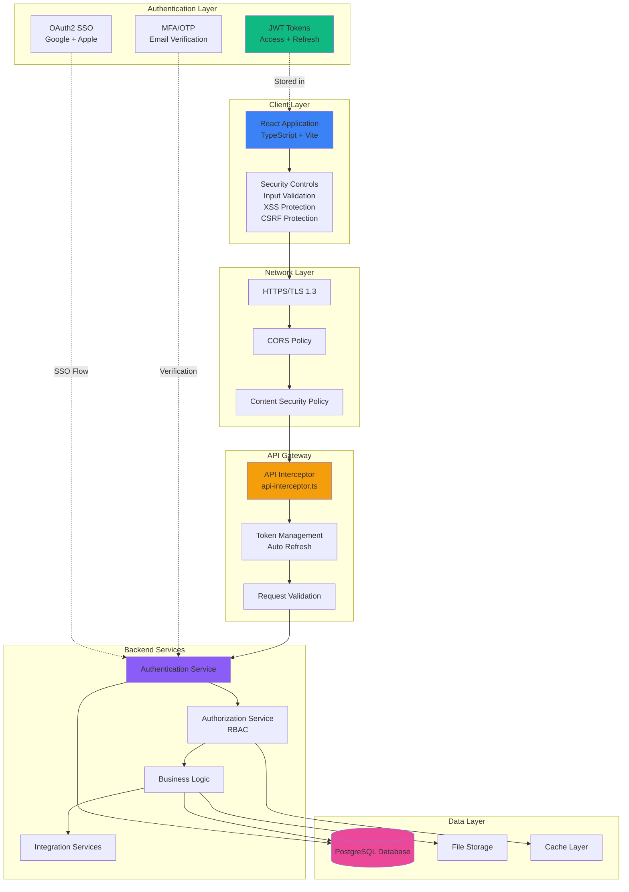
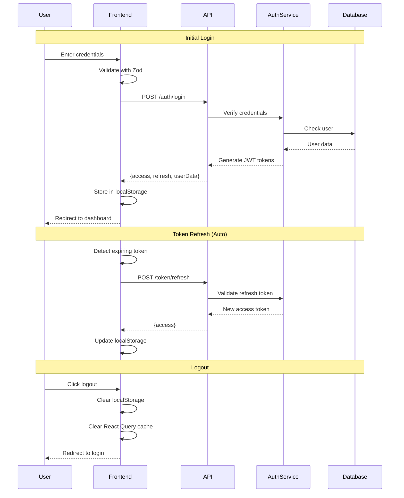
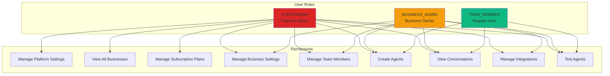
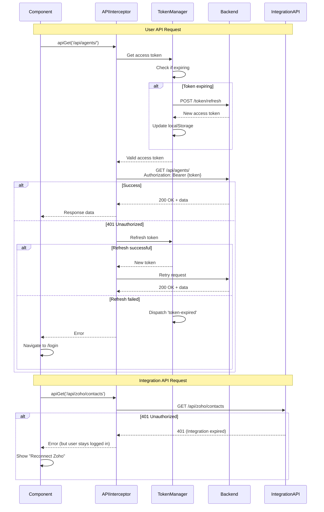
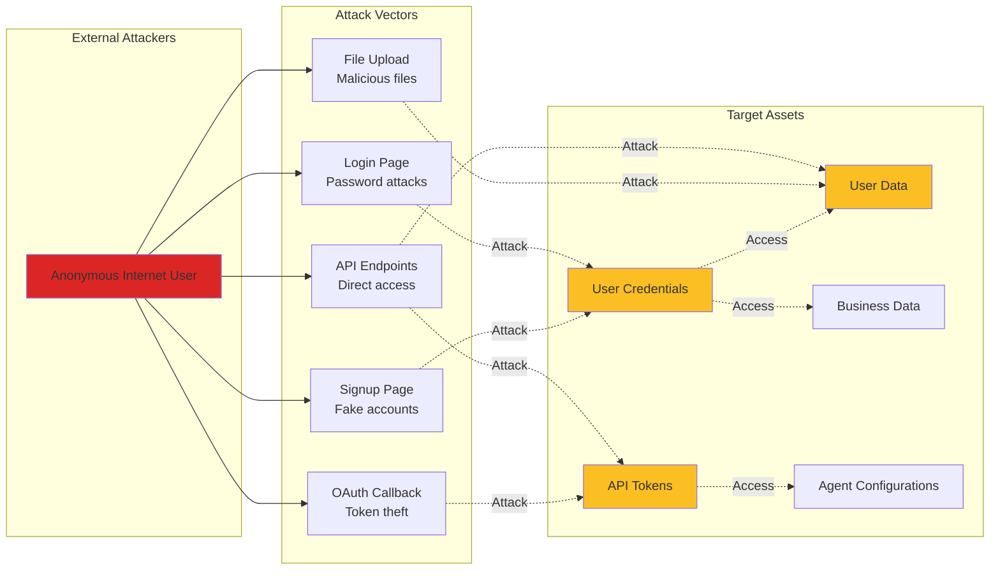
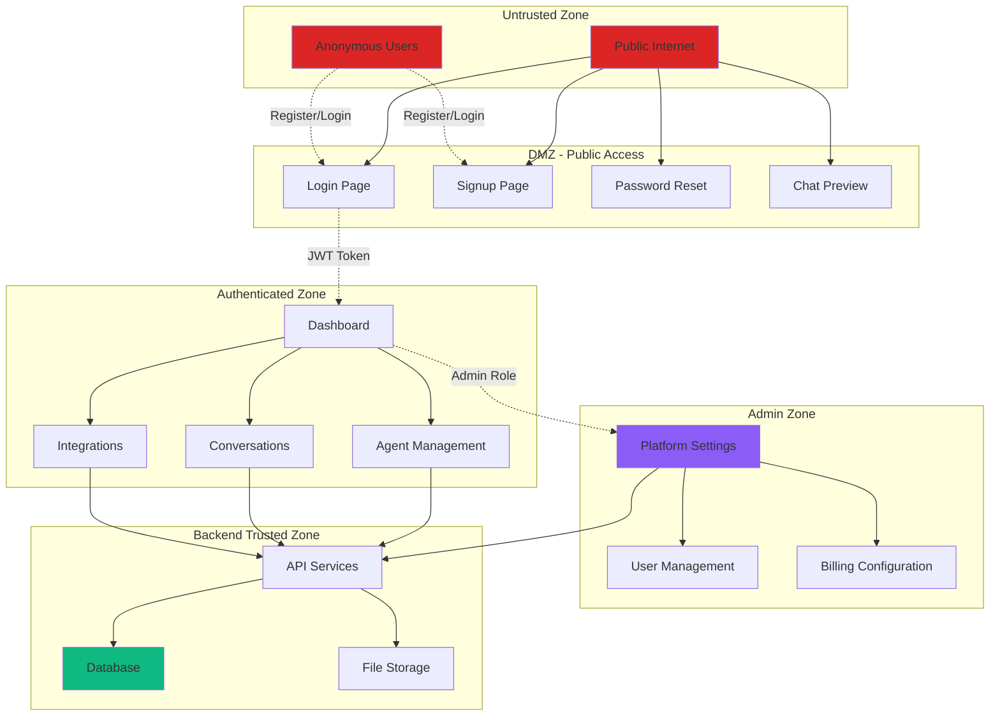
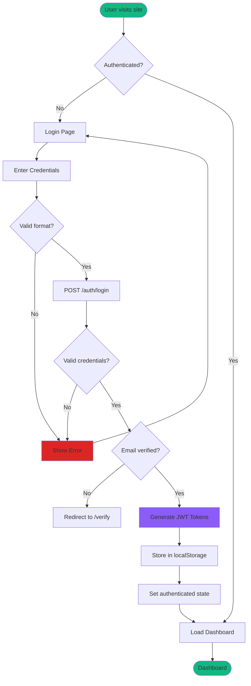
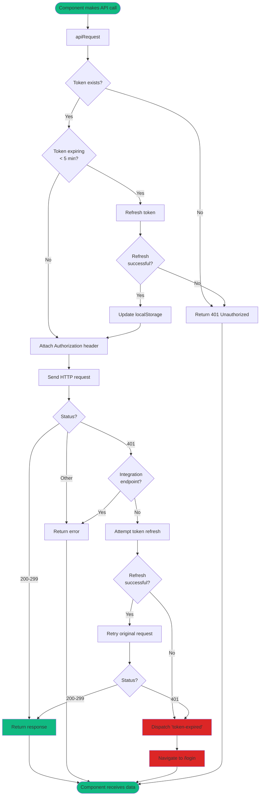

# Security Architecture Documentation for 7en.ai Platform

**Version:** 1.0  
**Last Updated:** 2025-10-10  
**Status:** Production Architecture

---

## Table of Contents

1. [Architecture Overview](#architecture-overview)
2. [Security Layers](#security-layers)
3. [Threat Model](#threat-model)
4. [Security Boundaries](#security-boundaries)
5. [Data Flow Diagrams](#data-flow-diagrams)
6. [Component Security](#component-security)

---

## Architecture Overview

The 7en.ai platform employs a **defense-in-depth** security strategy with multiple layers of protection. The architecture separates concerns between client-side security (React frontend), network security (HTTPS/TLS), authentication layer (JWT), and backend API security.

### High-Level Architecture



### Technology Stack Security

| Layer | Technology | Security Features |
|-------|------------|-------------------|
| **Frontend** | React 18 + TypeScript | JSX auto-escaping, type safety |
| **Build Tool** | Vite 5 | Fast builds, tree-shaking (no unused code) |
| **Routing** | React Router v6 | Protected routes, auth checks |
| **State** | React Query + Zustand | User-specific cache keys, automatic cleanup |
| **Validation** | Zod + React Hook Form | Schema validation, type coercion prevention |
| **Transport** | HTTPS/TLS 1.3 | Encryption in transit |
| **Auth** | JWT (JSON Web Tokens) | Stateless authentication |
| **OAuth** | Google/Apple OAuth2 | Delegated authentication |

---

## Security Layers

### Layer 1: Client-Side Security

**Purpose:** First line of defense against XSS, injection attacks, and client-side vulnerabilities.

**Components:**
- React's virtual DOM (automatic XSS protection)
- TypeScript (type safety, compile-time checks)
- Zod schemas (runtime input validation)
- Input sanitization (controlled Markdown rendering)

**Security Controls:**

```typescript
// Input validation with Zod
const signupSchema = z.object({
  email: z.string().email(),
  password: z.string()
    .min(8)
    .regex(/[A-Z]/, "Uppercase required")
    .regex(/[a-z]/, "Lowercase required")
    .regex(/[0-9]/, "Number required")
    .regex(/[^A-Za-z0-9]/, "Special char required"),
});

// React automatic escaping
<div>{userInput}</div> // Automatically escaped

// Controlled Markdown rendering
<ReactMarkdown
  rehypePlugins={[rehypeRaw]}
  remarkPlugins={[remarkGfm]}
>
  {content}
</ReactMarkdown>
```

**Threats Mitigated:**
- ✅ XSS (Cross-Site Scripting)
- ✅ Code injection
- ✅ HTML injection
- ✅ Invalid data types

---

### Layer 2: Network Security

**Purpose:** Protect data in transit and prevent network-level attacks.

**Components:**
- HTTPS/TLS 1.3 encryption
- CORS (Cross-Origin Resource Sharing) policy
- Content Security Policy (CSP)
- Secure headers

**Security Controls:**

```typescript
// API configuration with HTTPS
export const API_BASE_URL = 'https://api.7en.ai/api/';

// CORS configuration (backend)
// Only allow requests from trusted origins:
// - https://7en.ai
// - https://staging.7en.ai
// - https://beta.7en.ai
```

**Recommended CSP Header:**
```html
<meta http-equiv="Content-Security-Policy" content="
  default-src 'self';
  script-src 'self' 'unsafe-inline' 'unsafe-eval' https://accounts.google.com;
  connect-src 'self' https://api.7en.ai wss://api.7en.ai;
  img-src 'self' data: https:;
  style-src 'self' 'unsafe-inline';
  frame-ancestors 'none';
">
```

**Threats Mitigated:**
- ✅ Man-in-the-middle (MITM) attacks
- ✅ Eavesdropping
- ✅ Cross-origin attacks
- ✅ Clickjacking
- ✅ Code injection via CDN compromise

---

### Layer 3: Authentication Layer

**Purpose:** Verify user identity and manage sessions securely.

**Components:**
- JWT (JSON Web Tokens) - Access + Refresh tokens
- OAuth2 SSO (Google, Apple)
- Multi-factor authentication (OTP via email)
- Email verification

**JWT Architecture:**



**Security Controls:**

```typescript
// Token storage
localStorage.setItem('user', JSON.stringify({
  id: userId,
  name: userName,
  email: userEmail,
  role: userRole,
  accessToken: jwtAccessToken,    // Short-lived (30 min)
  refreshToken: jwtRefreshToken,  // Long-lived (7 days)
  isVerified: true
}));

// Token expiration check
const isTokenExpiring = (token: string): boolean => {
  const decoded = decodeJWT(token);
  const timeUntilExpiration = decoded.exp - Math.floor(Date.now() / 1000);
  return timeUntilExpiration < 300; // 5 minutes
};

// Automatic token refresh
if (isTokenExpiring(accessToken)) {
  await refreshAccessToken();
}
```

**Threats Mitigated:**
- ✅ Credential theft
- ✅ Session hijacking
- ✅ Brute force attacks (strong password policy)
- ✅ Unauthorized access
- ✅ Token expiration attacks

---

### Layer 4: Authorization Layer

**Purpose:** Control access to resources based on user roles and permissions.

**Components:**
- Role-Based Access Control (RBAC)
- Business ID isolation (multi-tenancy)
- Resource ownership validation
- Permission context

**RBAC Model:**



**Security Controls:**

```typescript
// User role definition
export type UserRole = 'USER' | 'SUPERADMIN';

export interface User {
  id: string;
  role: UserRole;
  businessId: string;  // Multi-tenancy isolation
  teamRole: string;
  permission: Record<string, boolean>;
}

// Route protection
const checkAuth = () => {
  const user = localStorage.getItem('user');
  if (!user && !PUBLIC_PATHS.includes(currentPath)) {
    navigate('/login');
  }
};

// Authorization check
const canAccessResource = (resource: Resource, user: User): boolean => {
  // Check ownership
  if (resource.userId !== user.id) return false;
  
  // Check business ID
  if (resource.businessId !== user.businessId) return false;
  
  // Check role
  if (resource.requiresAdmin && user.role !== 'SUPERADMIN') return false;
  
  return true;
};
```

**Threats Mitigated:**
- ✅ Privilege escalation (vertical)
- ✅ Unauthorized data access (horizontal)
- ✅ Cross-tenant data leakage
- ✅ Insecure direct object references (IDOR)

---

### Layer 5: API Security

**Purpose:** Secure all communication between frontend and backend.

**Components:**
- Centralized API interceptor
- Automatic token attachment
- Request retry logic
- Integration endpoint isolation

**API Security Flow:**



**Security Controls:**

```typescript
// Centralized API request function
export const apiRequest = async (
  url: string,
  options: RequestInit = {},
  authRequired: boolean = true
): Promise<Response> => {
  // Get access token
  const user = localStorage.getItem('user');
  const accessToken = user ? JSON.parse(user).accessToken : null;
  
  // Check if token is expiring
  if (accessToken && isTokenExpiring(accessToken)) {
    await refreshAccessToken();
  }
  
  // Attach authorization header
  const headers = {
    ...options.headers,
    ...(authRequired && accessToken && {
      'Authorization': `Bearer ${accessToken}`
    })
  };
  
  // Make request
  const response = await fetch(url, { ...options, headers });
  
  // Handle 401 errors
  if (response.status === 401 && authRequired) {
    // Check if this is an integration endpoint
    if (!isIntegrationEndpoint(url)) {
      // User endpoint - try to refresh token
      const newToken = await refreshAccessToken();
      if (newToken) {
        // Retry request with new token
        return fetch(url, {
          ...options,
          headers: { ...headers, 'Authorization': `Bearer ${newToken}` }
        });
      }
      // Refresh failed - trigger logout
      window.dispatchEvent(new CustomEvent('token-expired'));
    }
  }
  
  return response;
};

// Integration endpoint protection
const INTEGRATION_ENDPOINTS = [
  'zoho/', 'hubspot/', 'salesforce/', 'zendesk/',
  'freshdesk/', 'drive/', 'slack/', 'whatsapp/'
];

const isIntegrationEndpoint = (url: string): boolean => {
  return INTEGRATION_ENDPOINTS.some(endpoint => url.includes(endpoint));
};
```

**Threats Mitigated:**
- ✅ Unauthorized API access
- ✅ Token theft (short expiration times)
- ✅ Session fixation
- ✅ API abuse
- ✅ Integration failures causing user logout

---

### Layer 6: Data Security

**Purpose:** Protect data at rest and in use.

**Components:**
- Database encryption (PostgreSQL)
- Cache isolation (user-specific keys)
- Secure file storage
- Data sanitization

**Cache Security:**

```typescript
// User-specific cache keys
export const useAdminDashboard = () => {
  const { user } = useAuth();
  
  return useQuery({
    queryKey: ['admin-dashboard', user?.id], // Isolated by user ID
    queryFn: fetchDashboardData,
    enabled: !!user?.id
  });
};

// Cache clearing on logout
const logout = () => {
  console.log('🔒 Clearing all caches');
  clearAllReactQueryCaches(queryClient);
  
  setUser(null);
  setIsAuthenticated(false);
  localStorage.removeItem('user');
  navigate('/login');
};
```

**Threats Mitigated:**
- ✅ Cross-user data contamination
- ✅ Data leakage between sessions
- ✅ Cache poisoning
- ✅ Sensitive data exposure

---

## Threat Model

### STRIDE Threat Analysis

| Threat Category | Specific Threats | Mitigations |
|-----------------|------------------|-------------|
| **Spoofing** | Fake login, session hijacking | JWT tokens, MFA, strong passwords, token expiration |
| **Tampering** | Modified API requests, XSS | HTTPS, input validation, Zod schemas, React escaping |
| **Repudiation** | Denying actions | (⚠️ Need: Activity logging) |
| **Information Disclosure** | Data leaks, XSS, API data exposure | HTTPS, authorization checks, minimal error messages |
| **Denial of Service** | Brute force, resource exhaustion | (⚠️ Need: Rate limiting, CAPTCHA) |
| **Elevation of Privilege** | Admin access, IDOR | RBAC, resource ownership validation, business ID isolation |

### Attack Surface Analysis



### Risk Assessment

| Asset | Threat | Likelihood | Impact | Risk Level | Mitigation Status |
|-------|--------|------------|--------|------------|-------------------|
| User Passwords | Brute force | Medium | High | 🔴 High | ✅ Strong policy + MFA |
| JWT Tokens | Theft via XSS | Low | High | 🟡 Medium | ✅ React escaping |
| API Keys | Hardcoded in code | Low | Critical | 🟡 Medium | ✅ Environment variables |
| User Data | SQL injection | Low | Critical | 🟡 Medium | ✅ Parameterized queries (backend) |
| Business Data | IDOR | Medium | High | 🔴 High | ✅ Authorization checks |
| Session | Hijacking | Medium | High | 🔴 High | ✅ Short token expiration |

**Risk Scoring:**
- 🟢 Low: Unlikely and low impact
- 🟡 Medium: Possible with moderate impact
- 🔴 High: Likely or critical impact

---

## Security Boundaries

### Trust Boundaries



### Data Classification

| Data Type | Classification | Storage | Encryption | Access Control |
|-----------|---------------|---------|------------|----------------|
| Passwords | Critical | Database (hashed) | bcrypt/Argon2 | Never exposed |
| JWT Tokens | Secret | localStorage | N/A (transmitted over HTTPS) | User-specific |
| User PII | Confidential | Database | TLS in transit | User + Admins |
| Business Data | Confidential | Database | TLS in transit | Business members only |
| Agent Config | Internal | Database | TLS in transit | Business members only |
| Conversations | Confidential | Database | TLS in transit | Business members only |
| API Keys (external) | Secret | Database (encrypted) | AES-256 | Business members only |
| Audit Logs | Internal | Database | TLS in transit | Admins only |

---

## Data Flow Diagrams

### User Authentication Flow



### API Request Flow with Token Refresh



---

## Component Security

### Frontend Components

| Component | Security Concerns | Mitigations |
|-----------|-------------------|-------------|
| **LoginForm** | Credential theft, brute force | Zod validation, HTTPS, strong password policy |
| **SignupForm** | Fake accounts, weak passwords | Email verification, password complexity, CAPTCHA (⚠️ future) |
| **AgentBuilder** | XSS in agent config, unauthorized access | Input validation, RBAC checks |
| **ConversationList** | IDOR, data leakage | Business ID filtering, authorization checks |
| **FileUpload** | Malicious files, XSS via filenames | File type validation, size limits, name sanitization |
| **IntegrationsPage** | OAuth token theft, CSRF | OAuth2 flow, state parameter validation |

### Critical Files

```
src/
├── utils/
│   ├── api-interceptor.ts      🔒 Critical - API security
│   ├── auth-config.ts          🔒 Critical - OAuth config
│   └── api-config.ts           🔒 Critical - API endpoints
├── context/
│   └── AuthContext.tsx         🔒 Critical - Auth state management
├── components/
│   └── auth/
│       ├── LoginForm.tsx       🔒 High - User authentication
│       ├── SignupForm.tsx      🔒 High - User registration
│       └── OtpVerificationPanel.tsx  🔒 High - MFA
└── hooks/
    ├── useAuth.ts              🔒 High - Auth hooks
    └── useConversations.tsx    🔒 Medium - Data access
```

---

## Conclusion

The 7en.ai platform security architecture implements **defense-in-depth** with multiple layers of protection:

1. ✅ **Client-side security:** Input validation + XSS protection
2. ✅ **Network security:** HTTPS + CORS + CSP (⚠️ pending)
3. ✅ **Authentication:** JWT + OAuth2 + MFA
4. ✅ **Authorization:** RBAC + resource ownership validation
5. ✅ **API security:** Centralized interceptor + token management
6. ✅ **Data security:** Cache isolation + secure storage

**Security Posture:** **Strong** (8.5/10)

**Recommended Improvements:**
1. Implement Content Security Policy (CSP) headers
2. Add rate limiting on backend
3. Enhance security logging and monitoring
4. Add DOMPurify for HTML sanitization
5. Implement Subresource Integrity (SRI) for external scripts

---

**Document Maintained By:** Security Architecture Team  
**Last Review:** 2025-10-10  
**Next Review:** 2026-01-10
