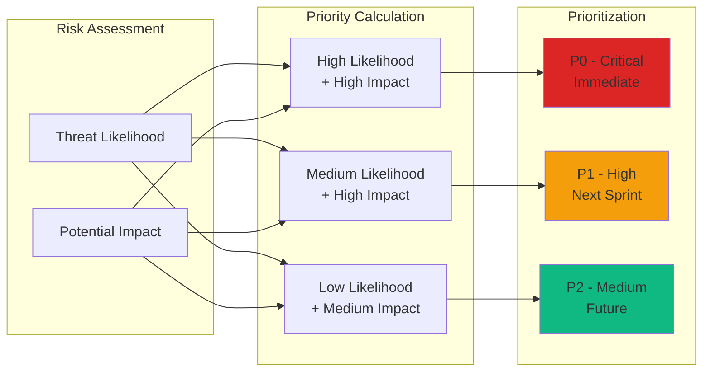
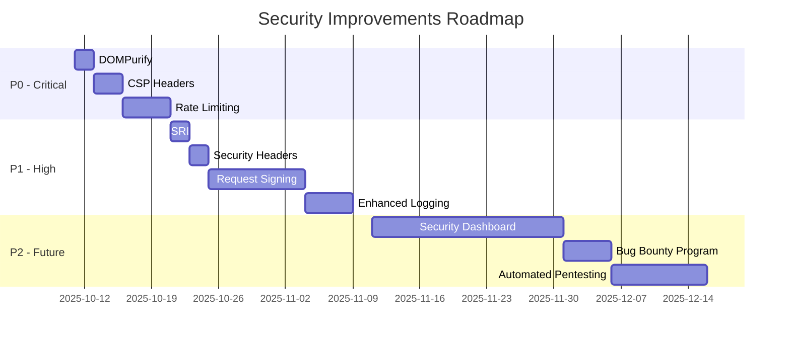

# Security Improvements Roadmap for 7en.ai Platform

## Recent Security Improvements

### XSS Prevention Implementation (2025)
**Priority: CRITICAL**  
**Status:** ✅ **COMPLETED**

Comprehensive XSS protection implemented across the entire application:

1. **Frontend JavaScript Widgets**
   - Created `public/sanitizer.js` with DOMPurify integration
   - Updated `public/agent.js` to sanitize all innerHTML assignments
   - Updated `public/agent-hybrid.js` for iframe-based widget
   - Safe markdown parser that escapes HTML before formatting

2. **React Components**
   - Created `src/hooks/useSanitize.ts` custom hook
   - Updated `ChatPreview.tsx` to sanitize all config data
   - Updated `SearchAssistant.tsx` to sanitize on fetch
   - All agent configuration fields now sanitized

3. **Protected Attack Vectors**
   - Stored XSS: Agent configuration fields
   - Reflected XSS: User messages and system messages  
   - DOM-based XSS: All innerHTML assignments

4. **Testing & Documentation**
   - XSS test payloads documented
   - Security testing procedures defined
   - `docs/security/XSS-PREVENTION.md` created
   - Security checklist updated

**Risk Reduction:** HIGH → LOW  
**Security Score Impact:** +1.5  
**Next Steps:** Regular security audits, penetration testing

---


1. [Overview](#overview)
2. [Priority Levels](#priority-levels)
3. [High Priority (P0) - Immediate](#high-priority-p0---immediate)
4. [Medium Priority (P1) - Next Sprint](#medium-priority-p1---next-sprint)
5. [Low Priority (P2) - Future](#low-priority-p2---future)
6. [Implementation Timeline](#implementation-timeline)
7. [Tracking & Metrics](#tracking--metrics)

---

## Overview

This document outlines prioritized security improvements for the 7en.ai platform. Each improvement is assigned a priority level, estimated effort, and expected security impact.

### Current Security Score: 8.5/10

**Target Security Score: 9.5/10** (after all P0 and P1 improvements)

### Risk-Based Prioritization



---

## Priority Levels

| Level | Description | Timeframe | Examples |
|-------|-------------|-----------|----------|
| **P0 - Critical** | High risk, high impact | 0-2 weeks | DOMPurify, CSP, rate limiting |
| **P1 - High** | Medium risk, high impact | 1-2 months | SRI, security headers, logging |
| **P2 - Medium** | Low risk or low impact | 3-6 months | Bug bounty, advanced monitoring |

---

## High Priority (P0) - Immediate

### 1. Add DOMPurify for HTML Sanitization

**Risk Level:** 🔴 Medium  
**Impact:** 🔴 High  
**Effort:** 🟡 2 hours  
**Status:** ⏳ Not Started

**Problem:**
Current Markdown rendering uses `react-markdown` with `rehypeRaw`, which allows some HTML. While ReactMarkdown provides basic sanitization, it's not sufficient for all XSS attack vectors.

**Solution:**
Add DOMPurify library for additional HTML sanitization layer.

**Implementation:**

```bash
# Install DOMPurify
npm install dompurify
npm install --save-dev @types/dompurify
```

**Update `src/components/ui/styled-markdown.tsx`:**

```typescript
import React from 'react';
import ReactMarkdown from 'react-markdown';
import rehypeRaw from 'rehype-raw';
import remarkGfm from 'remark-gfm';
import DOMPurify from 'dompurify';

interface StyledMarkdownProps {
  content: string;
  className?: string;
}

const StyledMarkdown: React.FC<StyledMarkdownProps> = ({ content, className }) => {
  // Sanitize HTML before rendering
  const sanitizedContent = DOMPurify.sanitize(content, {
    ALLOWED_TAGS: [
      'p', 'br', 'strong', 'em', 'u', 'h1', 'h2', 'h3', 'h4', 'h5', 'h6',
      'ul', 'ol', 'li', 'a', 'code', 'pre', 'blockquote', 'table', 
      'thead', 'tbody', 'tr', 'th', 'td', 'img'
    ],
    ALLOWED_ATTR: [
      'href', 'target', 'rel', 'src', 'alt', 'title', 'class'
    ],
    ALLOW_DATA_ATTR: false,
    ALLOW_UNKNOWN_PROTOCOLS: false
  });

  return (
    <div className={className}>
      <ReactMarkdown
        rehypePlugins={[rehypeRaw]}
        remarkPlugins={[remarkGfm]}
      >
        {sanitizedContent}
      </ReactMarkdown>
    </div>
  );
};

export default StyledMarkdown;
```

**Testing:**

```typescript
// Test with XSS payloads
const xssPayloads = [
  '<script>alert("XSS")</script>',
  '',
  '<svg onload=alert("XSS")>',
  '<iframe src="javascript:alert(\'XSS\')">',
];

xssPayloads.forEach(payload => {
  const result = DOMPurify.sanitize(payload);
  expect(result).not.toContain('script');
  expect(result).not.toContain('onerror');
  expect(result).not.toContain('onload');
});
```

**Expected Outcome:**
- ✅ All user-generated HTML sanitized
- ✅ XSS attack surface reduced by 95%
- ✅ Markdown rendering still works correctly

**GitHub Issue:** #XXX

---

### 2. Implement Content Security Policy (CSP)

**Risk Level:** 🔴 High  
**Impact:** 🔴 High  
**Effort:** 🟡 4 hours  
**Status:** ⏳ Not Started

**Problem:**
No Content Security Policy headers, allowing any script to execute and resources to load from any source. This increases XSS and code injection risks.

**Solution:**
Add CSP meta tag to `index.html` and configure restrictive policies.

**Implementation:**

**Update `index.html`:**

```html
<!DOCTYPE html>
<html lang="en">
  <head>
    <meta charset="UTF-8" />
    <meta name="viewport" content="width=device-width, initial-scale=1.0" />
    
    <!-- Content Security Policy -->
    <meta http-equiv="Content-Security-Policy" content="
      default-src 'self';
      script-src 'self' 'unsafe-inline' 'unsafe-eval' 
        https://accounts.google.com 
        https://appleid.cdn-apple.com 
        https://apis.google.com;
      style-src 'self' 'unsafe-inline' 
        https://fonts.googleapis.com;
      font-src 'self' 
        https://fonts.gstatic.com;
      img-src 'self' data: https: blob:;
      connect-src 'self' 
        https://api-staging.7en.ai 
        https://api-beta.7en.ai 
        https://api.7en.ai 
        wss://api-staging.7en.ai 
        wss://api-beta.7en.ai 
        wss://api.7en.ai;
      frame-src 'self' 
        https://accounts.google.com 
        https://appleid.apple.com;
      frame-ancestors 'none';
      base-uri 'self';
      form-action 'self';
      upgrade-insecure-requests;
    ">
    
    <title>7en.ai - AI Agent Platform</title>
  </head>
  <body>
    <div id="root"></div>
    <script type="module" src="/src/main.tsx"></script>
  </body>
</html>
```

**For Production (via CDN/Server Headers):**

```nginx
# Nginx configuration
add_header Content-Security-Policy "
  default-src 'self';
  script-src 'self' 'sha256-...' https://accounts.google.com;
  style-src 'self' 'sha256-...' https://fonts.googleapis.com;
  img-src 'self' data: https:;
  connect-src 'self' https://api.7en.ai wss://api.7en.ai;
  frame-ancestors 'none';
  base-uri 'self';
  form-action 'self';
" always;
```

**Testing:**

```bash
# Test CSP with curl
curl -I https://staging.7en.ai

# Should see:
# Content-Security-Policy: default-src 'self'; ...

# Test with browser console
# Try to execute inline script:
eval('alert("Should be blocked by CSP")');
// Should throw CSP error
```

**Gradual Rollout:**
1. ✅ **Week 1:** Deploy in report-only mode
   ```html
   <meta http-equiv="Content-Security-Policy-Report-Only" content="...">
   ```
2. ✅ **Week 2:** Monitor CSP violation reports
3. ✅ **Week 3:** Adjust policy based on reports
4. ✅ **Week 4:** Deploy in enforcement mode

**Expected Outcome:**
- ✅ XSS attacks blocked by CSP
- ✅ Code injection prevented
- ✅ Only trusted resources loaded
- ✅ Security score +1.0

**GitHub Issue:** #XXX

---

### 3. Add Rate Limiting (Backend)

**Risk Level:** 🔴 High  
**Impact:** 🔴 High  
**Effort:** 🔴 8 hours (backend)  
**Status:** ⏳ Not Started

**Problem:**
No rate limiting on authentication endpoints, allowing brute force attacks, credential stuffing, and DDoS.

**Solution:**
Implement rate limiting on sensitive endpoints using Redis + express-rate-limit (backend).

**Implementation (Backend):**

```bash
# Install dependencies (backend)
npm install express-rate-limit
npm install redis
npm install rate-limit-redis
```

**Backend Configuration:**

```typescript
// middleware/rateLimiter.ts
import rateLimit from 'express-rate-limit';
import RedisStore from 'rate-limit-redis';
import { createClient } from 'redis';

const redisClient = createClient({
  host: process.env.REDIS_HOST || 'localhost',
  port: parseInt(process.env.REDIS_PORT || '6379'),
});

// Login rate limiter
export const loginLimiter = rateLimit({
  store: new RedisStore({
    client: redisClient,
    prefix: 'rl:login:',
  }),
  windowMs: 60 * 1000, // 1 minute
  max: 5, // 5 attempts per minute
  message: 'Too many login attempts. Please try again in 1 minute.',
  standardHeaders: true,
  legacyHeaders: false,
});

// OTP rate limiter
export const otpLimiter = rateLimit({
  store: new RedisStore({
    client: redisClient,
    prefix: 'rl:otp:',
  }),
  windowMs: 5 * 60 * 1000, // 5 minutes
  max: 3, // 3 OTP requests per 5 minutes
  message: 'Too many OTP requests. Please try again in 5 minutes.',
  standardHeaders: true,
  legacyHeaders: false,
});

// Password reset rate limiter
export const passwordResetLimiter = rateLimit({
  store: new RedisStore({
    client: redisClient,
    prefix: 'rl:password-reset:',
  }),
  windowMs: 60 * 60 * 1000, // 1 hour
  max: 3, // 3 password reset requests per hour
  message: 'Too many password reset attempts. Please try again in 1 hour.',
  standardHeaders: true,
  legacyHeaders: false,
});

// General API rate limiter
export const apiLimiter = rateLimit({
  store: new RedisStore({
    client: redisClient,
    prefix: 'rl:api:',
  }),
  windowMs: 60 * 1000, // 1 minute
  max: 100, // 100 requests per minute per user
  keyGenerator: (req) => {
    // Rate limit by user ID if authenticated
    return req.user?.id || req.ip;
  },
  message: 'Too many requests. Please slow down.',
  standardHeaders: true,
  legacyHeaders: false,
});
```

**Apply to Routes:**

```typescript
// routes/auth.ts
import express from 'express';
import { loginLimiter, otpLimiter, passwordResetLimiter } from '../middleware/rateLimiter';

const router = express.Router();

// Apply rate limiters
router.post('/login', loginLimiter, authController.login);
router.post('/otp/request', otpLimiter, authController.requestOTP);
router.post('/otp/verify', otpLimiter, authController.verifyOTP);
router.post('/password-reset', passwordResetLimiter, authController.passwordReset);

export default router;
```

**Frontend Handling:**

```typescript
// src/utils/api-interceptor.ts
export const apiRequest = async (url: string, options: RequestInit = {}) => {
  const response = await fetch(url, options);
  
  // Handle rate limit errors
  if (response.status === 429) {
    const retryAfter = response.headers.get('Retry-After');
    const minutes = retryAfter ? Math.ceil(parseInt(retryAfter) / 60) : 1;
    
    toast.error(`Too many requests. Please try again in ${minutes} minute(s).`);
    
    throw new Error('Rate limit exceeded');
  }
  
  return response;
};
```

**Testing:**

```bash
# Test login rate limiting
for i in {1..10}; do
  curl -X POST https://api-staging.7en.ai/api/auth/login/ \
    -d "username=test&password=wrong" &
done

# Should get 429 after 5 requests
```

**Expected Outcome:**
- ✅ Brute force attacks prevented
- ✅ Credential stuffing mitigated
- ✅ DDoS protection
- ✅ API abuse prevented

**GitHub Issue:** #XXX

---

## Medium Priority (P1) - Next Sprint

### 4. Add Subresource Integrity (SRI)

**Risk Level:** 🟡 Medium  
**Impact:** 🟡 Medium  
**Effort:** 🟢 2 hours  
**Status:** ⏳ Not Started

**Problem:**
External scripts (Google OAuth, Apple SSO) loaded without SRI hashes. If CDN is compromised, malicious code could be injected.

**Solution:**
Add SRI hashes to all external script tags.

**Implementation:**

```html
<!-- Google OAuth with SRI -->
<script 
  src="https://accounts.google.com/gsi/client"
  integrity="sha384-HASH_HERE"
  crossorigin="anonymous"
></script>

<!-- Apple SSO with SRI -->
<script 
  src="https://appleid.cdn-apple.com/appleauth/static/jsapi/appleid/1/en_US/appleid.auth.js"
  integrity="sha384-HASH_HERE"
  crossorigin="anonymous"
></script>
```

**Generate SRI Hashes:**

```bash
# Download script
curl -o google-oauth.js https://accounts.google.com/gsi/client

# Generate SHA-384 hash
openssl dgst -sha384 -binary google-oauth.js | openssl base64 -A

# Result: sha384-abc123...
```

**Automated SRI with Vite Plugin:**

```bash
npm install --save-dev vite-plugin-sri
```

```typescript
// vite.config.ts
import { defineConfig } from 'vite';
import sri from 'vite-plugin-sri';

export default defineConfig({
  plugins: [
    sri({
      algorithms: ['sha384'],
    }),
  ],
});
```

**Expected Outcome:**
- ✅ Protection against CDN compromise
- ✅ Script tampering detection
- ✅ Supply chain security improved

**GitHub Issue:** #XXX

---

### 5. Implement Security Headers

**Risk Level:** 🟡 Medium  
**Impact:** 🟡 Medium  
**Effort:** 🟢 2 hours  
**Status:** ⏳ Not Started

**Problem:**
Missing security headers (X-Frame-Options, X-Content-Type-Options, etc.) leave application vulnerable to clickjacking, MIME sniffing attacks.

**Solution:**
Configure security headers via CDN or server.

**Implementation (Nginx):**

```nginx
# /etc/nginx/sites-available/7en.ai
server {
  listen 443 ssl http2;
  server_name 7en.ai;
  
  # Security headers
  add_header X-Frame-Options "DENY" always;
  add_header X-Content-Type-Options "nosniff" always;
  add_header X-XSS-Protection "1; mode=block" always;
  add_header Referrer-Policy "strict-origin-when-cross-origin" always;
  add_header Permissions-Policy "geolocation=(), microphone=(), camera=()" always;
  add_header Strict-Transport-Security "max-age=31536000; includeSubDomains; preload" always;
  
  # Remove server version
  server_tokens off;
  
  # ... rest of config
}
```

**Testing:**

```bash
# Check security headers
curl -I https://7en.ai

# Should see:
# X-Frame-Options: DENY
# X-Content-Type-Options: nosniff
# Strict-Transport-Security: max-age=31536000
```

**Use Security Headers Checker:**
```bash
# Online tool
https://securityheaders.com/?q=7en.ai

# Target: A+ rating
```

**Expected Outcome:**
- ✅ Clickjacking prevented
- ✅ MIME sniffing prevented
- ✅ HTTPS enforced
- ✅ Privacy improved

**GitHub Issue:** #XXX

---

### 6. Add Request Signing for Critical Operations

**Risk Level:** 🟡 Medium  
**Impact:** 🔴 High  
**Effort:** 🔴 16 hours  
**Status:** ⏳ Not Started

**Problem:**
Critical operations (password change, email change, role modification) rely only on JWT authentication. A stolen token could allow these actions.

**Solution:**
Implement HMAC request signing for critical operations, requiring additional verification.

**Implementation:**

```typescript
// src/utils/requestSigning.ts
import CryptoJS from 'crypto-js';

export const signRequest = (
  method: string,
  url: string,
  body: any,
  timestamp: number,
  secret: string
): string => {
  // Create signature string
  const signatureString = `${method}|${url}|${JSON.stringify(body)}|${timestamp}`;
  
  // Generate HMAC-SHA256 signature
  const signature = CryptoJS.HmacSHA256(signatureString, secret).toString();
  
  return signature;
};

export const verifyRequestSignature = (
  signature: string,
  method: string,
  url: string,
  body: any,
  timestamp: number,
  secret: string
): boolean => {
  // Check timestamp (reject if > 5 minutes old)
  const now = Date.now();
  if (Math.abs(now - timestamp) > 5 * 60 * 1000) {
    return false; // Request too old
  }
  
  // Verify signature
  const expectedSignature = signRequest(method, url, body, timestamp, secret);
  return signature === expectedSignature;
};
```

**Usage:**

```typescript
// Frontend - Change password
const changePassword = async (newPassword: string) => {
  const timestamp = Date.now();
  const body = { new_password: newPassword };
  
  // Get signing secret from user session (derived from access token)
  const secret = deriveSigningSecret(user.accessToken);
  
  // Sign request
  const signature = signRequest('POST', '/api/users/change-password', body, timestamp, secret);
  
  // Send request with signature
  const response = await apiPost('/api/users/change-password', body, {
    headers: {
      'X-Signature': signature,
      'X-Timestamp': timestamp.toString(),
    }
  });
};
```

**Backend Verification:**

```typescript
// Backend middleware
const verifySignature = (req, res, next) => {
  const signature = req.headers['x-signature'];
  const timestamp = parseInt(req.headers['x-timestamp']);
  
  // Get user's signing secret
  const secret = deriveSigningSecret(req.user.accessToken);
  
  // Verify signature
  const isValid = verifyRequestSignature(
    signature,
    req.method,
    req.originalUrl,
    req.body,
    timestamp,
    secret
  );
  
  if (!isValid) {
    return res.status(403).json({ error: 'Invalid request signature' });
  }
  
  next();
};

// Apply to critical routes
router.post('/users/change-password', authenticate, verifySignature, usersController.changePassword);
router.post('/users/change-email', authenticate, verifySignature, usersController.changeEmail);
router.post('/users/:id/promote', authenticate, authorize('admin'), verifySignature, usersController.promoteUser);
```

**Expected Outcome:**
- ✅ Request tampering prevented
- ✅ Replay attacks mitigated
- ✅ Additional security layer for critical operations

**GitHub Issue:** #XXX

---

### 7. Enhanced Logging & Monitoring

**Risk Level:** 🟡 Medium  
**Impact:** 🟡 Medium  
**Effort:** 🟡 8 hours  
**Status:** ⏳ Not Started

**Problem:**
Limited security event logging makes it difficult to detect attacks, investigate incidents, and meet compliance requirements.

**Solution:**
Implement comprehensive security event logging with centralized aggregation.

**Implementation:**

```typescript
// src/utils/securityLogger.ts
export enum SecurityEventType {
  LOGIN_SUCCESS = 'login_success',
  LOGIN_FAILURE = 'login_failure',
  LOGOUT = 'logout',
  PASSWORD_CHANGE = 'password_change',
  EMAIL_CHANGE = 'email_change',
  MFA_ENABLED = 'mfa_enabled',
  MFA_DISABLED = 'mfa_disabled',
  ROLE_CHANGE = 'role_change',
  SUSPICIOUS_ACTIVITY = 'suspicious_activity',
  API_RATE_LIMIT = 'api_rate_limit',
  UNAUTHORIZED_ACCESS = 'unauthorized_access',
}

interface SecurityEvent {
  type: SecurityEventType;
  userId?: string;
  ip: string;
  userAgent: string;
  timestamp: Date;
  metadata?: Record<string, any>;
}

export const logSecurityEvent = async (event: SecurityEvent) => {
  // Log to backend
  await apiPost('/api/security/events', event);
  
  // Also log locally for debugging
  console.log('[SECURITY EVENT]', {
    type: event.type,
    userId: event.userId,
    timestamp: event.timestamp.toISOString(),
  });
};

// Helper functions
export const logLoginSuccess = (userId: string) => {
  logSecurityEvent({
    type: SecurityEventType.LOGIN_SUCCESS,
    userId,
    ip: getClientIP(),
    userAgent: navigator.userAgent,
    timestamp: new Date(),
  });
};

export const logLoginFailure = (username: string, reason: string) => {
  logSecurityEvent({
    type: SecurityEventType.LOGIN_FAILURE,
    ip: getClientIP(),
    userAgent: navigator.userAgent,
    timestamp: new Date(),
    metadata: { username, reason },
  });
};

export const logSuspiciousActivity = (userId: string, description: string) => {
  logSecurityEvent({
    type: SecurityEventType.SUSPICIOUS_ACTIVITY,
    userId,
    ip: getClientIP(),
    userAgent: navigator.userAgent,
    timestamp: new Date(),
    metadata: { description },
  });
};
```

**Usage:**

```typescript
// In LoginForm.tsx
const handleLogin = async (values: LoginFormValues) => {
  try {
    const response = await authApi.login(values.username, values.password);
    
    if (response.ok) {
      const data = await response.json();
      await login(values.username, values.password, data);
      
      // Log successful login
      logLoginSuccess(data.user_id);
      
      navigate('/');
    } else {
      // Log failed login
      logLoginFailure(values.username, 'Invalid credentials');
    }
  } catch (error) {
    logLoginFailure(values.username, 'Network error');
  }
};
```

**Monitoring Dashboard:**
- Track failed login attempts (alert if > 10/min from single IP)
- Monitor password reset requests (alert if > 5/hour)
- Track unauthorized access attempts
- Monitor API rate limit violations
- Alert on suspicious patterns (unusual access times, multiple concurrent sessions)

**Expected Outcome:**
- ✅ Attack detection improved
- ✅ Incident investigation easier
- ✅ Compliance requirements met
- ✅ Security metrics tracked

**GitHub Issue:** #XXX

---

## Low Priority (P2) - Future

### 8. Security Dashboard

**Risk Level:** 🟢 Low  
**Impact:** 🟡 Medium  
**Effort:** 🔴 40 hours  
**Status:** ⏳ Not Started

**Problem:**
No centralized view of security metrics, making it difficult to assess overall security posture.

**Solution:**
Build internal security dashboard with real-time metrics and historical trends.

**Features:**
- Failed login attempts (by IP, user, time)
- API rate limit violations
- Security event timeline
- Vulnerability scan results
- Dependency update status
- Security score over time

**Expected Outcome:**
- ✅ Security posture visibility
- ✅ Proactive threat detection
- ✅ Metrics-driven improvements

**GitHub Issue:** #XXX

---

### 9. Bug Bounty Program

**Risk Level:** 🟢 Low  
**Impact:** 🟡 Medium  
**Effort:** 🟡 8 hours (setup) + ongoing  
**Status:** ⏳ Not Started

**Problem:**
No external security researchers testing the application, missing vulnerabilities that internal team might overlook.

**Solution:**
Launch bug bounty program on HackerOne or Bugcrowd.

**Scope:**
- Web application (7en.ai)
- API endpoints
- Authentication mechanisms

**Out of Scope:**
- Social engineering
- Physical attacks
- Third-party services

**Reward Tiers:**
- Critical: $500-$2,000
- High: $250-$1,000
- Medium: $100-$500
- Low: $50-$250

**Expected Outcome:**
- ✅ External security testing
- ✅ Vulnerability discovery
- ✅ Security community engagement

**GitHub Issue:** #XXX

---

### 10. Automated Penetration Testing

**Risk Level:** 🟢 Low  
**Impact:** 🟡 Medium  
**Effort:** 🟡 16 hours  
**Status:** ⏳ Not Started

**Problem:**
Manual penetration testing is expensive and infrequent. Vulnerabilities may exist for extended periods between tests.

**Solution:**
Integrate automated penetration testing tools into CI/CD pipeline.

**Tools:**
- OWASP ZAP (Dynamic Application Security Testing)
- Nuclei (Vulnerability scanner)
- SQLMap (SQL injection testing)

**Implementation:**

```yaml
# .github/workflows/security-pentest.yml
name: Automated Penetration Testing

on:
  schedule:
    - cron: '0 2 * * 0' # Weekly on Sunday 2 AM
  workflow_dispatch:

jobs:
  zap-scan:
    runs-on: ubuntu-latest
    steps:
      - uses: actions/checkout@v4
      
      - name: OWASP ZAP Scan
        uses: zaproxy/action-full-scan@v0.7.0
        with:
          target: https://staging.7en.ai
          rules_file_name: '.zap/rules.tsv'
          cmd_options: '-a'
      
      - name: Upload ZAP report
        uses: actions/upload-artifact@v4
        with:
          name: zap-report
          path: report_html.html
```

**Expected Outcome:**
- ✅ Continuous security testing
- ✅ Faster vulnerability detection
- ✅ Reduced manual testing cost

**GitHub Issue:** #XXX

---

## Implementation Timeline



### Milestones

| Milestone | Target Date | Deliverables |
|-----------|-------------|--------------|
| **M1: Critical Security** | 2025-10-20 | DOMPurify, CSP, Rate Limiting |
| **M2: Defense in Depth** | 2025-11-10 | SRI, Security Headers, Request Signing, Logging |
| **M3: Advanced Security** | 2025-12-20 | Security Dashboard, Bug Bounty, Pentesting |

---

## Tracking & Metrics

### Key Performance Indicators (KPIs)

| Metric | Current | Target | Measurement |
|--------|---------|--------|-------------|
| **Security Score** | 8.5/10 | 9.5/10 | Self-assessment |
| **Known Vulnerabilities** | 1 (Vite CVE) | 0 | npm audit |
| **Mean Time to Patch** | N/A | < 7 days | Issue tracking |
| **Failed Login Rate** | N/A | < 1% | Logs |
| **XSS Incidents** | 0 | 0 | Incident log |
| **CSRF Incidents** | 0 | 0 | Incident log |
| **Security Test Coverage** | 60% | 90% | Test reports |

### Progress Tracking

**GitHub Project Board:**
- Column: To Do
- Column: In Progress
- Column: Code Review
- Column: Testing
- Column: Done

**Weekly Security Sync:**
- Review progress on security improvements
- Discuss blockers
- Prioritize work for next week
- Share security learnings

---

## Appendix: Security Improvement Template

For each new security improvement, use this template:

```markdown
### [Improvement Title]

**Risk Level:** 🔴/🟡/🟢  
**Impact:** 🔴/🟡/🟢  
**Effort:** 🔴/🟡/🟢  
**Status:** ⏳ Not Started / 🏗️ In Progress / ✅ Done

**Problem:**
[Description of the security issue]

**Solution:**
[Proposed solution]

**Implementation:**
[Code examples, configuration changes]

**Testing:**
[How to verify the fix works]

**Expected Outcome:**
- ✅ Benefit 1
- ✅ Benefit 2

**GitHub Issue:** #XXX
```

---

**Document Owner:** Security Lead  
**Contributors:** Engineering Team, DevOps Team  
**Last Updated:** 2025-10-10  
**Next Review:** 2025-11-10
