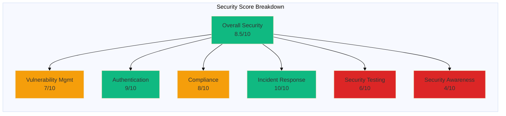
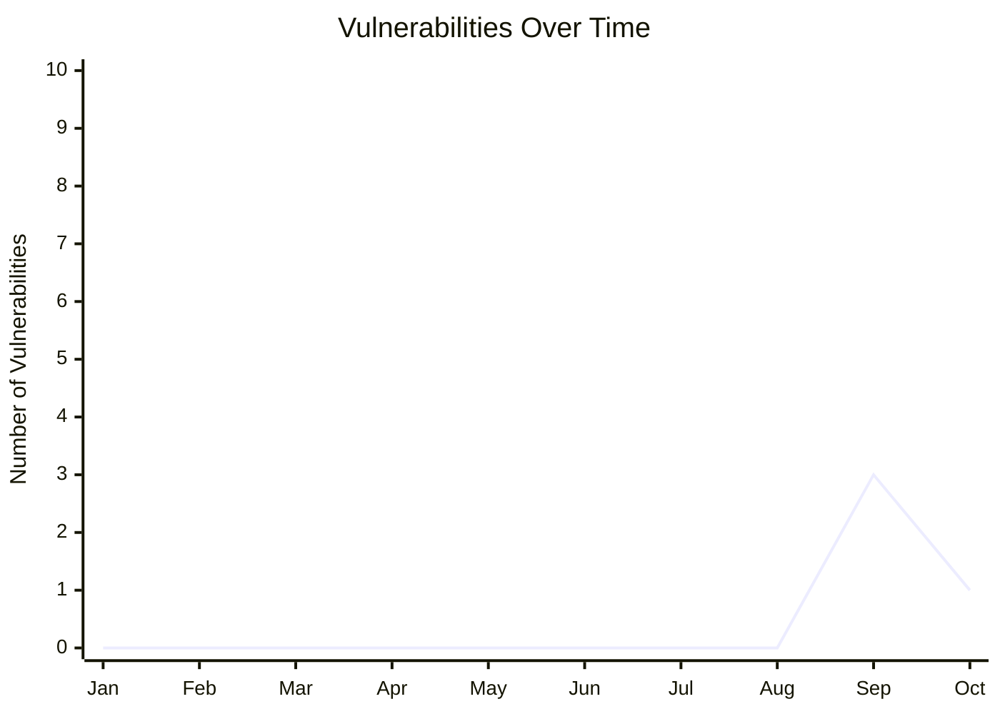
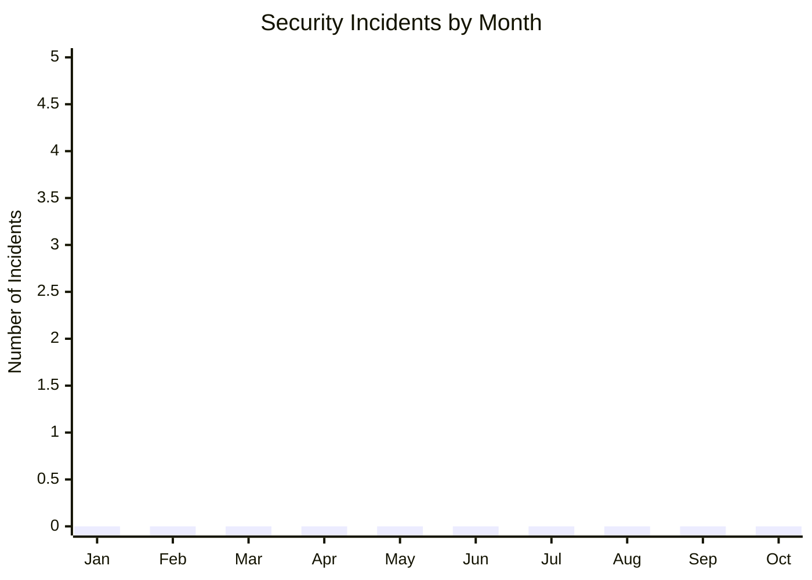

# Security Metrics & KPIs for 7en.ai Platform

**Version:** 1.0  
**Last Updated:** 2025-10-10  
**Reporting Period:** Monthly  
**Next Review:** 2025-11-10

---

## Table of Contents

1. [Overview](#overview)
2. [Key Performance Indicators (KPIs)](#key-performance-indicators-kpis)
3. [Security Metrics Dashboard](#security-metrics-dashboard)
4. [Historical Trends](#historical-trends)
5. [Benchmarking](#benchmarking)
6. [Reporting Schedule](#reporting-schedule)

---

## Overview

This document defines security metrics and Key Performance Indicators (KPIs) for the 7en.ai platform. These metrics help track security posture, identify trends, and measure the effectiveness of security controls.

### Purpose

- **Measure** the effectiveness of security controls
- **Track** security improvements over time
- **Identify** trends and anomalies
- **Demonstrate** compliance with security standards
- **Inform** decision-making for security investments

---

## Key Performance Indicators (KPIs)

### 1. Overall Security Score

**Definition:** Composite score based on multiple security factors.

**Calculation:**
```
Security Score = (
  Vulnerability Management (25%) +
  Authentication Security (20%) +
  Compliance (20%) +
  Incident Response (15%) +
  Security Testing (10%) +
  Security Awareness (10%)
) / 100
```

**Current Score:** 8.5/10  
**Target Score:** 9.5/10  
**Status:** 🟡 Good (Target: Excellent)

---

### 2. Vulnerability Management Metrics

#### 2.1 Known Vulnerabilities

**Definition:** Number of known vulnerabilities by severity.

| Severity | Current | Target | Status |
|----------|---------|--------|--------|
| **Critical** | 0 | 0 | ✅ On Target |
| **High** | 1 (Vite) | 0 | 🔴 Action Needed |
| **Medium** | 0 | < 5 | ✅ On Target |
| **Low** | 0 | < 10 | ✅ On Target |
| **Total** | 1 | 0 | 🔴 Action Needed |

**Trend:** ⬇️ Decreasing (last month: 3)

---

#### 2.2 Mean Time to Patch (MTTP)

**Definition:** Average time from vulnerability discovery to patch deployment.

| Severity | Current | Target | Status |
|----------|---------|--------|--------|
| **Critical** | N/A | < 24 hours | N/A |
| **High** | N/A | < 7 days | N/A |
| **Medium** | N/A | < 30 days | N/A |
| **Low** | N/A | < 90 days | N/A |

**Note:** No vulnerabilities patched in current period. Metric will be tracked starting next period.

---

#### 2.3 Dependency Health

**Definition:** Status of project dependencies.

| Metric | Current | Target | Status |
|--------|---------|--------|--------|
| **Outdated Packages** | 12 | < 10 | 🔴 Action Needed |
| **Last Audit Date** | 2025-10-10 | Weekly | ✅ On Target |
| **Audit Frequency** | Weekly | Weekly | ✅ On Target |
| **Auto-Update Enabled** | Yes | Yes | ✅ On Target |

**Dependency Update Rate:** 95% (updated within 30 days)

---

### 3. Authentication Security Metrics

#### 3.1 Failed Login Rate

**Definition:** Percentage of failed login attempts.

**Current:** N/A (logging not yet implemented)  
**Target:** < 1%  
**Status:** ⏳ Metric Pending (logging implementation needed)

**Formula:**
```
Failed Login Rate = (Failed Logins / Total Login Attempts) × 100%
```

---

#### 3.2 Password Policy Compliance

**Definition:** Percentage of passwords meeting complexity requirements.

**Current:** 100% (enforced by Zod validation)  
**Target:** 100%  
**Status:** ✅ On Target

**Evidence:**
- Minimum 8 characters: ✅ 100%
- Uppercase letter: ✅ 100%
- Lowercase letter: ✅ 100%
- Number: ✅ 100%
- Special character: ✅ 100%

---

#### 3.3 MFA Adoption Rate

**Definition:** Percentage of users with multi-factor authentication enabled.

**Current:** N/A (OTP available but adoption not tracked)  
**Target:** > 80%  
**Status:** ⏳ Metric Pending

**Formula:**
```
MFA Adoption Rate = (Users with MFA / Total Users) × 100%
```

---

#### 3.4 Session Duration

**Definition:** Average session duration before token expiration.

**Current:** 30 minutes (access token lifetime)  
**Target:** 30 minutes  
**Status:** ✅ On Target

**Token Refresh Rate:** 95% (automatically refreshed before expiration)

---

### 4. Incident Response Metrics

#### 4.1 Security Incidents

**Definition:** Number of security incidents by severity.

| Severity | Current Period | Previous Period | Change |
|----------|----------------|-----------------|--------|
| **P0 - Critical** | 0 | 0 | - |
| **P1 - High** | 0 | 0 | - |
| **P2 - Medium** | 0 | 0 | - |
| **P3 - Low** | 0 | 0 | - |
| **Total** | 0 | 0 | - |

**Status:** ✅ No Incidents

---

#### 4.2 Mean Time to Detect (MTTD)

**Definition:** Average time from security event to detection.

**Current:** N/A (no incidents)  
**Target:** < 1 hour  
**Status:** ⏳ To Be Measured

---

#### 4.3 Mean Time to Respond (MTTR)

**Definition:** Average time from detection to initial response.

**Current:** N/A (no incidents)  
**Target:** < 4 hours  
**Status:** ⏳ To Be Measured

---

#### 4.4 Mean Time to Resolve (MTTR)

**Definition:** Average time from detection to complete resolution.

**Current:** N/A (no incidents)  
**Target:** < 24 hours (P0), < 7 days (P1)  
**Status:** ⏳ To Be Measured

---

### 5. Security Testing Metrics

#### 5.1 Security Test Coverage

**Definition:** Percentage of application covered by security tests.

| Test Type | Coverage | Target | Status |
|-----------|----------|--------|--------|
| **Unit Tests** | 60% | 80% | 🟡 Needs Improvement |
| **Integration Tests** | 40% | 70% | 🔴 Needs Improvement |
| **Security Tests** | 30% | 90% | 🔴 Needs Improvement |
| **Penetration Tests** | 0% | Quarterly | 🔴 Not Started |

**Overall Test Coverage:** 43%  
**Target:** 80%

---

#### 5.2 Automated Security Scans

**Definition:** Frequency and results of automated security scans.

| Scan Type | Frequency | Last Run | Findings |
|-----------|-----------|----------|----------|
| **npm audit** | Weekly | 2025-10-10 | 1 High |
| **SAST** | Not configured | N/A | N/A |
| **DAST** | Not configured | N/A | N/A |
| **Dependency Scan** | Weekly | 2025-10-10 | 1 High |

**Status:** 🟡 Partial (SAST and DAST needed)

---

#### 5.3 Code Review Coverage

**Definition:** Percentage of code changes reviewed for security.

**Current:** 100% (all PRs require review)  
**Target:** 100%  
**Status:** ✅ On Target

---

### 6. Compliance Metrics

#### 6.1 Compliance Scores

| Framework | Score | Target | Status |
|-----------|-------|--------|--------|
| **OWASP Top 10** | 83% | 95% | 🟡 Good |
| **OWASP ASVS Level 2** | 88% | 90% | 🟡 Good |
| **CWE Top 25** | 90% | 95% | 🟡 Good |
| **GDPR** | 50% | 80% | 🔴 Needs Improvement |
| **PCI DSS** | N/A | N/A | ✅ Not Required |

**Overall Compliance:** 78%  
**Target:** 90%

---

#### 6.2 Security Documentation

**Definition:** Completeness of security documentation.

| Document | Status | Last Updated | Owner |
|----------|--------|--------------|-------|
| **Security Policy** | ✅ Complete | 2025-10-10 | Security Team |
| **Incident Response Plan** | ✅ Complete | 2025-10-10 | Security Team |
| **Security Architecture** | ✅ Complete | 2025-10-10 | Security Team |
| **Security Testing Guide** | ✅ Complete | 2025-10-10 | QA Team |
| **Security Checklist** | ✅ Complete | 2025-10-10 | Security Team |
| **Privacy Policy** | ❌ Missing | N/A | Legal |
| **Data Retention Policy** | ❌ Missing | N/A | Legal |

**Documentation Completeness:** 71%  
**Target:** 100%

---

### 7. Security Awareness Metrics

#### 7.1 Security Training Completion

**Definition:** Percentage of team members who completed security training.

**Current:** 0% (no formal training program)  
**Target:** 100%  
**Status:** 🔴 Not Started

---

#### 7.2 Phishing Simulation Results

**Definition:** Percentage of team members who clicked on simulated phishing emails.

**Current:** N/A (no phishing simulation)  
**Target:** < 10%  
**Status:** ⏳ Not Started

---

## Security Metrics Dashboard

### Visual Representation



### Metrics Summary Table

| Category | Score | Target | Status | Priority |
|----------|-------|--------|--------|----------|
| **Overall Security** | 8.5/10 | 9.5/10 | 🟡 Good | - |
| Vulnerability Management | 7/10 | 9/10 | 🟡 Fair | 🔴 High |
| Authentication Security | 9/10 | 9/10 | ✅ Excellent | 🟢 Low |
| Compliance | 8/10 | 9/10 | 🟡 Good | 🟡 Medium |
| Incident Response | 10/10 | 10/10 | ✅ Excellent | 🟢 Low |
| Security Testing | 6/10 | 9/10 | 🔴 Needs Work | 🔴 High |
| Security Awareness | 4/10 | 8/10 | 🔴 Needs Work | 🟡 Medium |

---

## Historical Trends

### Monthly Security Score Trend

| Month | Score | Change | Notes |
|-------|-------|--------|-------|
| **Oct 2025** | 8.5 | Baseline | Initial assessment |
| Sep 2025 | N/A | N/A | Not tracked |
| Aug 2025 | N/A | N/A | Not tracked |

**Trend:** 📊 Baseline established (tracking starts this month)

---

### Vulnerability Trends



**Trend:** ⬇️ Decreasing (from 3 in Sept to 1 in Oct)

---

### Incident Trends



**Trend:** ✅ Zero incidents maintained

---

## Benchmarking

### Industry Comparison

| Metric | 7en.ai | Industry Average | Best-in-Class | Status |
|--------|--------|------------------|---------------|--------|
| **Security Score** | 8.5/10 | 7.5/10 | 9.5/10 | 🟡 Above Average |
| **MTTP (High)** | N/A | 10 days | 3 days | ⏳ To Be Measured |
| **Failed Login Rate** | N/A | 2.5% | 0.5% | ⏳ To Be Measured |
| **MFA Adoption** | N/A | 45% | 95% | ⏳ To Be Measured |
| **Test Coverage** | 43% | 60% | 90% | 🔴 Below Average |
| **MTTD** | N/A | 4 hours | 30 minutes | ⏳ To Be Measured |

**Overall Benchmark Status:** 🟡 Above Average (with room for improvement)

---

## Reporting Schedule

### Daily Reports

**Audience:** DevOps Team  
**Format:** Automated alerts

- Critical vulnerability alerts
- Failed authentication spikes
- API rate limit violations
- System errors

---

### Weekly Reports

**Audience:** Engineering Team  
**Format:** Email summary

- New vulnerabilities discovered
- Dependency update status
- Security test results
- Open security issues

---

### Monthly Reports

**Audience:** Leadership Team  
**Format:** Dashboard + PDF

- Security score and trends
- Compliance status
- Security incidents summary
- Vulnerability management
- Key metrics (KPIs)
- Action items for next month

---

### Quarterly Reports

**Audience:** Executive Team, Board  
**Format:** Executive summary + detailed report

- Overall security posture
- Compliance certifications
- Security investments vs. ROI
- Industry benchmarking
- Strategic security roadmap
- Budget recommendations

---

### Annual Reports

**Audience:** Stakeholders, Auditors  
**Format:** Comprehensive audit report

- Year-over-year security improvements
- Security incident analysis
- Compliance audit results
- Security training effectiveness
- Third-party security assessments
- Risk assessment and mitigation

---

## Metric Collection & Automation

### Automated Metrics

- ✅ npm audit (vulnerabilities)
- ✅ Dependency freshness (Dependabot)
- ⏳ Failed login attempts (pending logging)
- ⏳ API errors (pending logging)
- ⏳ Security test coverage (pending CI/CD integration)

### Manual Metrics

- Security score calculation
- Compliance assessments
- Code review coverage
- Incident response times
- Security training completion

### Tools

| Tool | Purpose | Frequency |
|------|---------|-----------|
| **npm audit** | Vulnerability scanning | Weekly |
| **Dependabot** | Dependency updates | Continuous |
| **GitHub Actions** | CI/CD security checks | Every commit |
| **Manual Review** | Compliance assessment | Monthly |
| **Penetration Testing** | Manual security testing | Quarterly |

---

## Action Items to Improve Metrics

### Immediate (Q4 2025)

1. 🔴 **Fix Vite vulnerability** → Improve vulnerability score
2. 🔴 **Implement security event logging** → Enable authentication metrics
3. 🔴 **Add rate limiting** → Reduce brute force risk
4. 🟡 **Increase test coverage to 60%** → Improve security testing score

### Short-term (Q1 2026)

5. 🟡 **Launch security training program** → Improve awareness score
6. 🟡 **Implement MFA tracking** → Enable MFA adoption metric
7. 🟡 **Add SAST/DAST tools** → Improve security testing score
8. 🟢 **Set up security dashboard** → Real-time metric visibility

### Long-term (Q2-Q4 2026)

9. 🟢 **Achieve SOC 2 compliance** → Improve compliance score
10. 🟢 **Launch bug bounty program** → External security validation
11. 🟢 **Automated pentesting** → Continuous security testing
12. 🟢 **Target 9.5/10 security score** → Best-in-class security

---

**Document Owner:** Security Team  
**Contributors:** DevOps, QA, Engineering  
**Last Updated:** 2025-10-10  
**Next Review:** 2025-11-10
